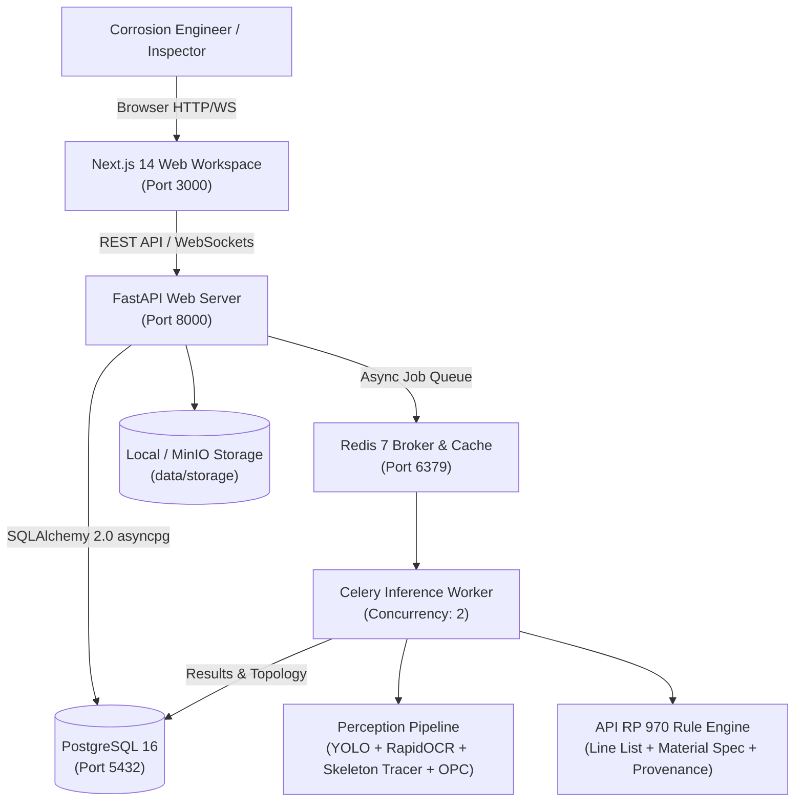

# P&ID Studio Web Platform — Production Deployment & Operations Guide

> **Version**: 1.0.0 (Production-Ready)  
> **Target Standard**: API RP 970 (Corrosion Control Documents & Circuitization)  
> **Deployment Model**: Containerized On-Premise (Docker Compose) or Native Host  

---

## 1. System Overview & Architecture

P&ID Studio Web Platform is an enterprise, web-based engineering system designed to digitize Piping and Instrumentation Diagrams (P&IDs) and automatically group piping lines into corrosion systems and circuits compliant with **API RP 970**.



---

## 2. Prerequisites

### Hardware Requirements:
- **CPU**: 4+ cores (x86_64)
- **RAM**: Minimum 8 GB (16 GB recommended for concurrent 350 DPI P&ID rasterization)
- **Storage**: Minimum 20 GB free disk space for drawing images, database, and model weights
- **GPU (Optional)**: NVIDIA GPU with CUDA 12+ for 4x accelerated inference (system automatically falls back to CPU if no GPU is detected)

### Software Requirements:
- **Docker**: Docker Engine 24.0+ and Docker Compose v2.20+ (for Containerized mode)
- **Native Host (Alternative)**: Python 3.11–3.13 and Node.js 18+ with npm 10+

---

## 3. Deployment Option 1: Docker Compose (Recommended)

Docker Compose orchestrates all 5 system containers with zero manual configuration.

### Quick Start:
1. Clone or navigate to the repository root:
   ```bash
   cd c:\Werk\pidccs
   ```
2. Generate your environment file:
   ```bash
   copy .env.example .env     # Windows
   cp .env.example .env        # Linux / macOS
   ```
3. Run the one-click startup script:
   - **Windows**: Double-click `start_docker.bat` or run:
     ```cmd
     .\start_docker.bat
     ```
   - **Linux / macOS**: Run:
     ```bash
     chmod +x start_docker.sh
     ./start_docker.sh
     ```
4. Access the applications:
   - **Web UI**: [http://localhost:3000](http://localhost:3000)
   - **REST API**: [http://localhost:8000](http://localhost:8000)
   - **Interactive API Documentation (Swagger)**: [http://localhost:8000/docs](http://localhost:8000/docs)

### Container Health & Status:
```bash
docker compose ps
```
Expected output:
```text
NAME                 IMAGE                 STATUS                   PORTS
pidstudio-postgres   postgres:16-alpine    Up (healthy)             0.0.0.0:5432->5432/tcp
pidstudio-redis      redis:7-alpine        Up (healthy)             0.0.0.0:6379->6379/tcp
pidstudio-api        pidccs-api            Up (healthy)             0.0.0.0:8000->8000/tcp
pidstudio-worker     pidccs-worker         Up                       
pidstudio-frontend   pidccs-frontend       Up                       0.0.0.0:3000->3000/tcp
```

---

## 4. Deployment Option 2: Native Local Execution

For developer workstations or direct testing without Docker:

### 1. Database & Cache
You can run PostgreSQL and Redis locally, or use SQLite in-memory for testing:
```bash
# In .env:
DATABASE_URL=sqlite+aiosqlite:///./pidstudio.db
CELERY_TASK_ALWAYS_EAGER=true
```

### 2. Backend API
```bash
cd backend
py -3.13 -m pip install -r requirements.txt
py -3.13 -m uvicorn app.main:app --host 0.0.0.0 --port 8000 --reload
```

### 3. Frontend Web App
```bash
cd frontend
npm install
npm run dev
```

Or execute `start_local.bat` to launch both in separate terminal windows automatically.

---

## 5. Configuration Reference (`.env`)

| Variable | Default Value | Description |
|---|---|---|
| `PROJECT_NAME` | `"P&ID Studio Web Platform"` | Display title of the system |
| `DEBUG` | `true` | Enables reload and verbose logging |
| `DATABASE_URL` | `postgresql+asyncpg://...` | Async database connection string |
| `REDIS_URL` | `redis://redis:6379/0` | Redis task broker for Celery |
| `CELERY_TASK_ALWAYS_EAGER`| `false` | Set `true` to execute tasks synchronously |
| `STORAGE_DIR` | `data/storage` | Path for uploaded drawings and deliverables |
| `WEIGHTS_DIR` | `runs` | Directory containing YOLO `.pt` model weights |
| `CACHE_DIR` | `.pidcache` | Temporary cache for preprocessed tiles |
| `DETECTOR_IMPL` | `yolo` | Symbol detector (`yolo` or `sahi`) |
| `OCR_IMPL` | `rapidocr` | OCR engine (`rapidocr` or `paddleocr`) |
| `TRACER_IMPL` | `skeleton` | Pipe tracing algorithm (`skeleton` or `morphology`)|
| `NEXT_PUBLIC_API_URL` | `http://localhost:8000` | Backend API base URL for web client |
| `NEXT_PUBLIC_WS_URL` | `ws://localhost:8000` | WebSocket URL for real-time progress |

---

## 6. Model Weights & Specification Data

Ensure the following assets exist in your deployment:

### 1. YOLO Model Weights (`runs/`):
- `runs/detect/equip_best/weights/best.pt`: Equipment & vessels detector.
- `runs/detect/valve_best/weights/best.pt`: Valves & inline components detector.
- `runs/detect/inst_best/weights/best.pt`: Instrumentation balloons detector.
- `runs/classify/valve_clf_best/weights/best.pt`: Valve subtype classifier.

### 2. Material & Circuit Specifications (`data/`):
- `data/material_spec.json`: Structured engineering mapping from piping classes (`CDA`, `CCC`, `ASA`, `DSA`, etc.) to base metallurgy, design pressure, design temperature, and corrosion allowance.
- `material_map.csv`: Fallback mapping for site-specific piping class abbreviations.

---

## 7. Deliverables & Exports

The platform produces 4 engineering-grade deliverable formats accessible via the UI or REST API:
- **Excel Line Register (`.xlsx`)**: Comprehensive tabular register with line number, fluid, class, operating temperature, pressure, CA, and assigned corrosion circuit.
- **Word Asset Register (`.docx`)**: Narrative plant equipment and piping report formatted for inspection readiness.
- **Vector Marked PDF (`.pdf`)**: Native Acrobat-editable vector PDF where every traced pipe run is a distinct, selectable, and color-coded `PolyLine` annotation.
- **Marked PNG Image (`.png`)**: High-resolution raster visualization overlaid with circuit boundary colors and line tags.

---

## 8. Verification & Smoke Testing

To verify operational readiness after deployment, run the automated smoke test suite:
```bash
py -3.13 scripts/smoke_test.py
```

Expected output:
```text
==================================================================
  P&ID Studio Web Platform - Deployment Smoke Test
==================================================================
[*] Checking Backend Liveness Probe (http://localhost:8000/healthz)... [OK] (HTTP 200)
[*] Checking Backend Readiness Probe (http://localhost:8000/readyz)... [OK] (HTTP 200)
[*] Checking Swagger UI Docs (http://localhost:8000/docs)... [OK] (HTTP 200)
[*] Checking REST API Projects Endpoint (http://localhost:8000/api/v1/projects)... [OK] (HTTP 200)
[*] Checking Next.js Web Interface (http://localhost:3000)... [OK] (HTTP 200)

  [PASS] API Liveness (/healthz)
  [PASS] API Readiness (/readyz)
  [PASS] OpenAPI Docs (/docs)
  [PASS] Database & Project Service
  [PASS] Frontend UI (Port 3000)

>>> ALL SERVICES OPERATIONAL AND READY FOR PRODUCTION! <<<
```

---

## 9. Maintenance & Troubleshooting

### Viewing Service Logs:
```bash
docker compose logs -f api       # FastAPI web server logs
docker compose logs -f worker    # Celery detection worker logs
docker compose logs -f frontend  # Next.js web client logs
docker compose logs -f postgres  # Database logs
```

### Database Backup:
```bash
docker exec -t pidstudio-postgres pg_dump -U postgres -d pidstudio > pidstudio_backup_$(date +%Y%m%d).sql
```

### Database Restore:
```bash
cat pidstudio_backup.sql | docker exec -i pidstudio-postgres psql -U postgres -d pidstudio
```

### Stopping Services:
```bash
docker compose down             # Stop containers, preserve database volume
docker compose down -v          # WARNING: Destroys database volumes
```
