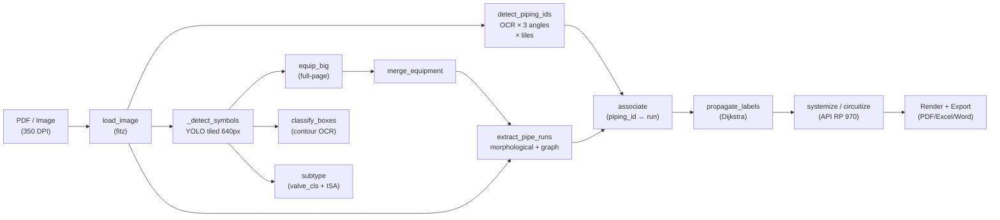
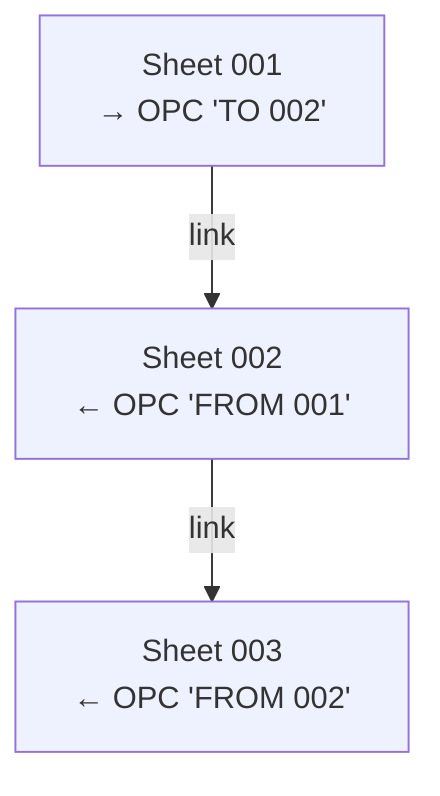
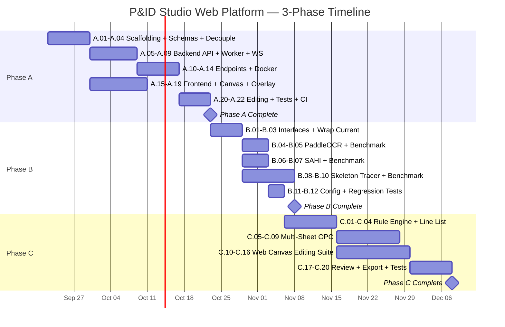

# P&ID Studio → Web Platform: Implementation Plan

## Sprint Handover: Canvas Stability, Single Sidebar Tab, Re-scan ROI, & Manual Pen

**Status**: Implemented and locally verified on 2026-09-18.

- Sidebar navigation is now one row: `Lines`, `Pipa (Inspector)`, `Symbols`, and `OPCs`.
- Removed the unsafe global `viewer.clearOverlays()` focus behavior; focus rectangles are managed independently from the React SVG tracing layer.
- Added event isolation, stable run keys, viewer readiness, and viewport sync for `update-viewport`, `animation-finish`, and `resize`.
- Added `POST /api/v1/projects/{project_id}/trace-region` with sensitive tracing, global coordinate offsets, persistence, and `source: "rescan"`.
- Added `Box Trace / Re-scan` and `Manual Pen`; manual runs use `manual-run-[timestamp]`, `#2563EB`, and `manual: true`.
- Added `Delete`/`Backspace`, `Escape`, and `Enter`/double-click shortcuts.
- Verification: `pytest backend/tests -q` -> **33 passed**, `npm run build` -> **passed**, `git diff --check` -> **passed**.
- Export continues to consume persisted `result.runs`, including re-scan and manual runs.
- Follow-up: add ROI clipping/empty-result tests and browser E2E coverage for overlay persistence.
> **Re-engineering P&ID Studio (desktop/PyQt5) menjadi modern Web-Based System**
> Scalable, containerized, maintainable — dengan Loose Coupling & Interface/Adapter Pattern.

---

## Executive Summary

Sistem saat ini adalah monolith desktop (PyQt5, ~137 KB `gui.py` + ~200 KB `pidcorr/`) yang menjalankan seluruh pipeline—dari PDF rendering, YOLO inference, OCR, line tracing, hingga API RP 970 systemization/circuitization—secara sinkron di thread tunggal.  
Re-engineering ini **memisahkan** concern menjadi 4 container: **Frontend SPA**, **Backend API**, **Inference Worker**, dan **Redis broker**—tanpa mengubah core algorithm yang sudah terbukti benar.

---

## Table of Contents

1. [Current System Analysis](#current-system-analysis)
2. [Phase A — Architecture Modernization](#phase-a--architecture-modernization-decoupling--environment-setup)
3. [Phase B — CV & Pipeline Modernization](#phase-b--computer-vision--pipeline-modernization-perception-core)
4. [Phase C — Engineering Engine & Web UI](#phase-c--api-rp-970-engineering-engine-multi-sheet--human-in-the-loop-web-ui)
5. [Cross-Cutting Concerns](#cross-cutting-concerns)
6. [Risk Register](#risk-register)

---

## Current System Analysis

### Architecture Overview

```
┌────────────────────────────────────────────────────────────┐
│                     gui.py (PyQt5, 2467 lines)             │
│  ┌──────────────────────────────────────────────────────┐  │
│  │  QGraphicsView/QGraphicsScene canvas                 │  │
│  │  - zoom/pan multi-megapixel P&ID                     │  │
│  │  - overlay bounding boxes, polyline pipe runs        │  │
│  │  - interactive rubber-band edit, click-to-select     │  │
│  │  - undo stack, autosave, multi-view (Digitize/       │  │
│  │    System/Circuit/Report)                             │  │
│  └──────────────────────────────────────────────────────┘  │
│  ┌──────────────────────────────────────────────────────┐  │
│  │  pidcorr/ package (19 modules)                       │  │
│  │  pipeline.py ─── orchestrator (YOLO + OCR + trace)   │  │
│  │  detect.py ───── tiled YOLO inference + NMS          │  │
│  │  piping_id.py ── multi-angle OCR + schema parser     │  │
│  │  lines.py ────── morphological line tracing + assoc  │  │
│  │  propagate.py ── Dijkstra label propagation          │  │
│  │  systemize.py ── API RP 970 system & circuit         │  │
│  │  connpoint.py ── connection point / spec break       │  │
│  │  asset_register.py ── Word/DOCX export               │  │
│  │  export.py ──── PDF annotation + Excel + PNG         │  │
│  │  validate.py ── automated consistency checks         │  │
│  │  review.py ──── anomaly flagging for engineer        │  │
│  │  + subtype, layout, feedback, groundtruth, etc.      │  │
│  └──────────────────────────────────────────────────────┘  │
│  5 YOLO models (.pt): pid3_finetune, equip_big,           │
│  layout_furniture, pid20_baseline, valve_cls               │
│  OCR engine: RapidOCR (ONNX Runtime)                      │
│  PDF: PyMuPDF (fitz) — deprecated on Python 3.14          │
└────────────────────────────────────────────────────────────┘
```

### Key Dependencies & Deprecation Risks

| Dependency | Current | Risk |
|---|---|---|
| PyQt5 | 5.15.11 | Desktop-only; no web deployment path |
| PyMuPDF (fitz) | ≥1.24 | **License changed to AGPL-3.0** in v1.24; deprecated API on Python 3.14 |
| Python | 3.13 only | `install.bat` explicitly blocks 3.14 |
| RapidOCR | 1.2.3 | ONNX Runtime dependency; no angle-aware mode |
| ultralytics | 8.4.70 | Stable; GPU optional |

### Existing Data Flow (per P&ID sheet)



### Processing Bottleneck Profile

| Stage | Estimated Time | Notes |
|---|---|---|
| OCR tiled (3 angles × ~30 tiles) | 60-180 sec | **~70% total**; brute-force 3-angle rotation |
| YOLO inference (tiled + full-page) | 10-30 sec | GPU reduces to ~5 sec |
| Line tracing + merge | 5-15 sec | CPU morphology |
| Systemization + propagation | < 1 sec | Pure graph/rules |
| Total (CPU only) | 75-230 sec | Per sheet |

---

## Phase A — Architecture Modernization, Decoupling & Environment Setup

### Module Objective & Boundaries

**Goal**: Menghilangkan dependensi desktop lokal (`install.bat`, PyQt5, fitz deprecation) menjadi arsitektur web client-server yang siap di-deploy via Docker. Core CV algorithms **tidak diubah**—hanya dibungkus dalam service boundary.

**In Scope**:
- Backend API (FastAPI) dengan async task queue
- Frontend SPA (React/Next.js) dengan interactive canvas
- Docker Compose orchestration
- Core data schemas (Pydantic)
- PDF rendering engine swap (PyMuPDF → `pdf2image` / `pypdfium2`)

**Deferred** (to Phase B/C):
- CV algorithm improvements (OCR upgrade, SAHI, etc.)
- Multi-sheet connector
- API RP 970 rule engine enhancements

---

### A.1 — System Architecture

#### Target Architecture

```
                                    ┌─────────────────────────┐
                                    │   Frontend (Next.js)    │
                                    │   Port 3000              │
                                    │                         │
                                    │  OpenSeadragon / Canvas  │
                                    │  React Query / Zustand   │
                                    │  WebSocket (progress)    │
                                    └───────────┬─────────────┘
                                                │ REST + WS
                                    ┌───────────▼─────────────┐
                                    │   Backend API (FastAPI)  │
                                    │   Port 8000              │
                                    │                         │
                                    │  /api/v1/projects       │
                                    │  /api/v1/detect         │
                                    │  /api/v1/results        │
                                    │  /api/v1/export         │
                                    │  /ws/progress/{job_id}  │
                                    └───────────┬─────────────┘
                                                │ task queue
                          ┌─────────────────────┼─────────────────────┐
                          │                     │                     │
                ┌─────────▼────────┐  ┌─────────▼────────┐  ┌────────▼───────┐
                │  Redis           │  │  Inference Worker │  │  Object Store  │
                │  (Broker +       │  │  (Celery/ARQ)     │  │  (MinIO / S3   │
                │   Result Backend │  │                   │  │   / local vol) │
                │   + Cache)       │  │  YOLO + OCR +     │  │                │
                │  Port 6379       │  │  Line Tracing +   │  │  uploads/      │
                │                  │  │  Systemization    │  │  results/      │
                └──────────────────┘  │                   │  │  tiles/        │
                                      │  GPU optional     │  └────────────────┘
                                      └───────────────────┘
```

#### Container Matrix

| Container | Base Image | Port | GPU | Role |
|---|---|---|---|---|
| `frontend` | `node:20-slim` | 3000 | No | Next.js SPA |
| `api` | `python:3.13-slim` | 8000 | No | FastAPI REST + WebSocket |
| `worker` | `python:3.13-slim` + CUDA optional | — | Optional | Celery/ARQ inference worker |
| `redis` | `redis:7-alpine` | 6379 | No | Message broker + cache |
| `minio` | `minio/minio` | 9000 | No | Object storage (dev only) |

---

### A.2 — Interface Contracts

#### A.2.1 Core Data Schemas (Pydantic v2)

```python
# schemas/symbol.py
class SymbolDetection(BaseModel):
    coarse: Literal["equipment", "instrument", "valve"]
    cls: str
    conf: float = Field(ge=0, le=1)
    x1: float; y1: float; x2: float; y2: float
    subtype: str = ""
    tag: str = ""
    desc: str = ""
    manual: bool = False

# schemas/piping.py
class PipingID(BaseModel):
    pid: str
    x1: float; y1: float; x2: float; y2: float
    unit: str = ""; size: str = ""; fluid: str = ""
    pclass: str = ""; seq: str = ""
    conf: int = 0
    run_idx: int = -1
    extra_runs: list[int] = []
    state: Literal["attached", "leader", "none", "manual", "propagated"] = "none"
    manual: bool = False

# schemas/run.py
class PipeRun(BaseModel):
    points: list[tuple[int, int]]  # ≥2 vertices
    axis: Literal["h", "v", "d", "poly"] = "poly"
    x1: int; y1: int; x2: int; y2: int
    underline: bool = False

# schemas/result.py
class DigitizationResult(BaseModel):
    image_path: str
    dpi: int = 350
    rot: int = 0
    w: int; h: int
    symbols: list[SymbolDetection] = []
    runs: list[PipeRun] = []
    piping_ids: list[PipingID] = []
    conn_points: list[ConnectionPoint] = []
    furniture: list[tuple[int, int, int, int]] = []

# schemas/system.py
class CorrosionSystem(BaseModel):
    index: int
    fluid: str
    color: tuple[int, int, int]
    run_idxs: list[int]
    pid_idxs: list[int]
    n_pipes: int
    circuits: list[CorrosionCircuit]

class CorrosionCircuit(BaseModel):
    code: str           # "01.02"
    material: str
    classes: list[str]
    color: tuple[int, int, int]
    run_idxs: list[int]
    pid_idxs: list[int]
```

#### A.2.2 REST API Contract

| Method | Path | Request | Response | Notes |
|---|---|---|---|---|
| `POST` | `/api/v1/projects` | `multipart (file)` | `{project_id, filename, status}` | Upload P&ID (PDF/PNG) |
| `GET` | `/api/v1/projects` | — | `[{project_id, filename, status, created_at}]` | List projects |
| `POST` | `/api/v1/projects/{id}/detect` | `{dpi?, rot?}` | `{job_id}` | Start async detection |
| `GET` | `/api/v1/jobs/{job_id}` | — | `{status, progress_pct, result?}` | Poll job |
| `WS` | `/ws/progress/{job_id}` | — | `{step, pct, msg}` stream | Real-time progress |
| `GET` | `/api/v1/projects/{id}/result` | — | `DigitizationResult` | Full detection result |
| `PATCH` | `/api/v1/projects/{id}/result` | JSON Patch array | `DigitizationResult` | Edit (bbox, split, reassign) |
| `POST` | `/api/v1/projects/{id}/systemize` | `{mode: system\|circuit}` | `[CorrosionSystem]` | Run grouping |
| `POST` | `/api/v1/projects/{id}/validate` | — | `ValidationReport` | Automated checks |
| `POST` | `/api/v1/projects/{id}/export` | `{format: xlsx\|docx\|pdf\|png}` | `{download_url}` | Export deliverable |
| `GET` | `/api/v1/projects/{id}/tiles/{z}/{x}/{y}.png` | — | PNG tile | Deep-zoom tile server |

#### A.2.3 WebSocket Progress Protocol

```json
{
  "type": "progress",
  "job_id": "abc-123",
  "step": "ocr_tiled",
  "current": 15,
  "total": 30,
  "message": "OCR tile 15/30",
  "pct": 50
}
```

---

### A.3 — Step-by-Step Task Breakdown

> Priority: P0 = blocker, P1 = high, P2 = nice-to-have

| # | Task | Priority | Depends On | Est. Days |
|---|---|---|---|---|
| A.01 | **Project scaffolding**: monorepo structure (`/backend`, `/frontend`, `/worker`, `/shared`) | P0 | — | 1 |
| A.02 | **Pydantic schemas** (§A.2.1): `SymbolDetection`, `PipingID`, `PipeRun`, `DigitizationResult`, `CorrosionSystem`, `CorrosionCircuit`, `ConnectionPoint`, `ValidationReport` | P0 | A.01 | 2 |
| A.03 | **Extract `pidcorr/` into pure library**: remove all PyQt5, cv2.imshow, gui-specific code from core modules; add `__all__` exports; ensure `pidcorr` importable standalone | P0 | A.01 | 2 |
| A.04 | **PDF rendering swap**: replace `fitz.open()` in `pipeline.load_image()` with `pypdfium2` (permissive license, Python 3.14 safe). Adapter: `class PDFRenderer(Protocol)` with `render_page(path, dpi) -> np.ndarray` | P0 | A.03 | 1 |
| A.05 | **FastAPI app skeleton**: `main.py`, CORS, health endpoint, error handlers, lifespan events for model preloading | P0 | A.01 | 1 |
| A.06 | **Redis + Celery/ARQ setup**: worker entry point, task registration, result backend config | P0 | A.05 | 2 |
| A.07 | **`/projects` CRUD endpoints**: upload multipart file → store in object storage (local vol or MinIO); list/get/delete | P0 | A.05, A.02 | 2 |
| A.08 | **`/detect` async task**: wrap `run_pipeline()` as Celery task with progress callback → Redis pub/sub | P0 | A.06, A.03 | 3 |
| A.09 | **WebSocket progress endpoint**: `/ws/progress/{job_id}` subscribing to Redis pub/sub, forwarding `{step, pct, msg}` to connected client | P0 | A.08 | 1 |
| A.10 | **`/result` GET**: return `DigitizationResult` from stored JSON | P0 | A.08, A.02 | 1 |
| A.11 | **`/systemize` + `/validate` endpoints**: thin wrappers calling `systemize.py` / `validate.py` | P1 | A.10 | 1 |
| A.12 | **`/export` endpoints**: generate XLSX/DOCX/PDF/PNG, return download URL | P1 | A.10, A.11 | 2 |
| A.13 | **Deep-zoom tile server**: on upload, generate DZI pyramid (256×256 tiles) via `pyvips` or OpenCV; serve via `/tiles/{z}/{x}/{y}.png` | P1 | A.07 | 2 |
| A.14 | **Dockerfile + docker-compose.yml**: multi-stage builds for api, worker, frontend; GPU passthrough option for worker | P0 | A.08 | 2 |
| A.15 | **Next.js project scaffold**: App Router, TypeScript, Tailwind CSS, project listing page | P0 | A.01 | 1 |
| A.16 | **OpenSeadragon canvas integration**: render DZI tiles, overlay layer for bounding boxes / polylines (SVG overlay or Konva.js) | P0 | A.13, A.15 | 3 |
| A.17 | **Detection trigger + progress UI**: "Detect" button → POST `/detect` → subscribe WS → progress bar → show result overlay | P0 | A.09, A.16 | 2 |
| A.18 | **Result overlay rendering**: draw symbols (colored bbox), pipe runs (polyline), piping IDs (violet bbox with label) on canvas — matching current GUI visual | P0 | A.16, A.10 | 3 |
| A.19 | **System/Circuit color view**: toggle modes, legend panel, pipe run coloring by fluid/material | P1 | A.18, A.11 | 2 |
| A.20 | **PATCH `/result` — basic editing**: click to select bbox, drag to move/resize, delete. JSON Patch sent to backend | P1 | A.18 | 3 |
| A.21 | **Integration tests**: end-to-end test from upload → detect → result → export using sample P&ID | P0 | A.12 | 2 |
| A.22 | **CI pipeline** (GitHub Actions / GitLab CI): lint, test, build Docker images | P2 | A.21 | 1 |

**Total Phase A Estimate**: ~38 developer-days

---

### A.4 — Measurable Verification Checklist (Definition of Done)

| ID | Criterion | Measurement | Target |
|---|---|---|---|
| DoD-A01 | Docker Compose `up` starts all 5 containers | `docker compose up --build` exits 0; health checks pass | 100% |
| DoD-A02 | Upload P&ID → detect → result JSON matches current `pidcorr` output | `DigitizationResult` diff ≤ floating-point epsilon | Exact match |
| DoD-A03 | Canvas renders 350 DPI P&ID (3300×2320 px) without lag | Time-to-interactive < 2 sec; 60 FPS pan/zoom on Chrome | Measured |
| DoD-A04 | WebSocket reports progress for OCR + YOLO stages | Client receives ≥ 10 distinct `{step, pct}` messages per job | Manual + unit test |
| DoD-A05 | Export XLSX/DOCX/PDF produces identical output to current desktop | Byte-level diff on sample P&ID (excluding timestamps) | Pass |
| DoD-A06 | PyMuPDF removed from runtime dependencies | `pip show PyMuPDF` returns not-found in API/worker containers | Pass |
| DoD-A07 | PyQt5 removed from runtime dependencies | No PyQt5 import in any file under `/backend` or `/worker` | grep pass |
| DoD-A08 | API contract tests (OpenAPI spec) | pytest-openapi validates all endpoints | 100% pass |
| DoD-A09 | Concurrent users: 3 simultaneous detections | Locust test: 3 parallel uploads+detections, all succeed | No failures |

---

### A.5 — Customization Hooks

| Hook Point | Interface / Extension Mechanism | Example Swap |
|---|---|---|
| **PDF Renderer** | `Protocol: PDFRenderer.render_page(path, dpi) -> ndarray` | `pypdfium2` → `pdf2image` (Poppler) → `pymupdf` (fallback) |
| **Object Storage** | `Protocol: ObjectStore.put(key, data)`, `.get(key)`, `.url(key)` | Local filesystem → MinIO → AWS S3 → GCS |
| **Task Queue** | `Protocol: TaskBroker.submit(fn, *args)`, `.status(job_id)` | Celery+Redis → ARQ → Dramatiq → cloud-native (Cloud Tasks) |
| **Result Persistence** | `Protocol: ResultStore.save(project_id, result)`, `.load(...)` | JSON file → PostgreSQL JSONB → MongoDB |
| **Progress Reporter** | `Protocol: ProgressReporter.report(step, pct, msg)` | Redis pub/sub → SSE → WebSocket direct |

---

## Phase B — Computer Vision & Pipeline Modernization (Perception Core)

### Module Objective & Boundaries

**Goal**: Meningkatkan **akurasi** dan **memangkas latency** pemrosesan P&ID tanpa mengubah API contract dari Phase A.

**In Scope**:
- Abstract base classes for CV components (Interface/Adapter Pattern)
- OCR engine upgrade (angle-aware, single-pass)
- SAHI multi-scale inference for symbol detection
- Enhanced line tracing (graph-based skeletonization)

**Deferred** (to Phase C):
- Multi-sheet connector
- Rule engine enhancements
- Web canvas editing suite

---

### B.1 — Interface Definitions (Adapter Pattern)

```python
# interfaces/perception.py
from abc import ABC, abstractmethod
import numpy as np

class BaseSymbolDetector(ABC):
    """Detects equipment, instruments, and valves in a P&ID image."""
    
    @abstractmethod
    def detect(self, img_bgr: np.ndarray, conf: float = 0.3,
               progress: Callable | None = None) -> list[SymbolDetection]:
        """Return detected symbols with bounding boxes and classifications."""
        ...
    
    @abstractmethod
    def load_weights(self, weights_path: str) -> None:
        ...

class BaseTextExtractor(ABC):
    """Extracts and parses piping IDs from a P&ID image."""
    
    @abstractmethod
    def extract(self, img_bgr: np.ndarray, tile: int = 1200,
                progress: Callable | None = None) -> tuple[list[PipingID], list[dict]]:
        """Return (piping_ids, tokens). Tokens used for connection point detection."""
        ...

class BaseLineTracer(ABC):
    """Traces pipe runs from a P&ID image."""
    
    @abstractmethod
    def trace(self, img_bgr: np.ndarray, dpi: int = 350,
              detections: list[SymbolDetection] | None = None,
              furniture: list[tuple] | None = None,
              progress: Callable | None = None) -> list[PipeRun]:
        """Return traced pipe runs as polylines."""
        ...

class BasePipingIDParser(ABC):
    """Parses a raw piping ID string into structured tokens."""
    
    @abstractmethod
    def parse(self, pid: str) -> dict[str, str]:
        """Return {unit, size, fluid, pclass, seq}."""
        ...
    
    @abstractmethod
    def register_schema(self, example_pid: str, schema: dict) -> None:
        """Learn a new company-specific schema from user example."""
        ...
```

### B.2 — OCR Engine Upgrade

#### Current Problem
OCR brute-force rotation (0°, 90°, 270°) pada setiap tile → **3× latency OCR** (bagian terlambat dari pipeline, ~70% total time). Banyak false match dari sudut non-natural.

#### Proposed Solution

| Component | Current | Proposed |
|---|---|---|
| OCR engine | RapidOCR 1.2.3 (ONNX) | PaddleOCR v4 angle-aware (det+cls+rec single-pass) |
| Rotation strategy | Brute-force 3 angles × tiles | **Single-pass**: text detector natively handles 0°/90°/180°/270° via angle classifier |
| Tile strategy | Fixed 1200px, 25% overlap | Adaptive tile: large tiles (2048px) with sparse overlap (15%) — text is large enough |
| OCR post-processing | Regex match per fragment | Same regex pipeline (proven reliable) — only front-end OCR changes |

**Expected Impact**:
- Latency: **3× speedup** (60-180 sec → 20-60 sec) per sheet
- Accuracy: slightly improved (fewer false matches from unnatural rotations)

#### Migration Strategy
1. Implement `PaddleOCRExtractor(BaseTextExtractor)` alongside existing `RapidOCRExtractor`
2. A/B test on 6 sample P&IDs (PetroChina dataset)
3. Switch default when recall ≥ current baseline

### B.3 — SAHI Multi-Scale Detection

#### Current Problem
Symbol detection uses **fixed 640px tiles** (homogeneous) — small symbols (instrument bubbles ~20px) and large equipment (vessels spanning 1500px) have different optimal scales. Large equipment handled by separate `equip_big` model → complex merge logic.

#### Proposed Solution

| Component | Current | Proposed |
|---|---|---|
| Tiling | Fixed 640px, 20% overlap | **SAHI** (Slicing Aided Hyper Inference): adaptive slicing 640+1280 px |
| Models | 2 separate models (`pid3_finetune` + `equip_big`) | Single unified model with SAHI multi-scale inference |
| NMS | Custom class-agnostic NMS | SAHI built-in NMS with per-class thresholds |
| Post-process | Manual `merge_equipment()` + `suppress_nested()` | SAHI automatic merge + configurable NMS IoU |

**Implementation**:
```python
class SAHISymbolDetector(BaseSymbolDetector):
    def detect(self, img_bgr, conf=0.3, progress=None):
        from sahi import AutoDetectionModel
        from sahi.predict import get_sliced_prediction
        
        result = get_sliced_prediction(
            img_bgr, self.model,
            slice_height=640, slice_width=640,
            overlap_height_ratio=0.2, overlap_width_ratio=0.2,
        )
        # + full-image pass for large equipment
        full_result = get_prediction(img_bgr, self.model)
        return self._merge(result, full_result)
```

### B.4 — Tracing Enhancement

#### Current Problem
Line tracing (morphological) handles straight H/V segments well, but struggles with:
1. **Crossover vs T-junction** ambiguity (two perpendicular pipes crossing ≠ junction)
2. **Diagonal segments** handled by separate Hough pass (noisy)
3. **Gap bridging** uses simple heuristic (inline valve check)

#### Proposed Solution: Graph-Based Skeletonization

| Stage | Current | Proposed |
|---|---|---|
| Segmentation | Binary morphology (open kernel) | **Zhang-Suen skeletonization** → junction detection → segment extraction |
| Junction handling | Degree-based merge only | **Junction classification**: 4-way = crossover (split into 2 independent paths), 3-way = T-junction (merge) |
| Diagonals | HoughLinesP on residual | Part of skeleton naturally |
| Gap bridging | Center-of-gap in inline symbol check | **Shortest-path through ink density** between near endpoints |

```python
class SkeletonLineTracer(BaseLineTracer):
    def trace(self, img_bgr, dpi=350, detections=None, 
              furniture=None, progress=None):
        skeleton = self._skeletonize(img_bgr)
        junctions = self._detect_junctions(skeleton)
        segments = self._extract_segments(skeleton, junctions)
        segments = self._classify_crossovers(segments, junctions, img_bgr)
        segments = self._suppress_non_pipe(segments, detections, furniture)
        runs = self._merge_runs(segments)
        return runs
```

---

### B.5 — Step-by-Step Task Breakdown

| # | Task | Priority | Status | Output / Deliverable |
|---|---|---|---|---|
| B.01 | **Define abstract interfaces**: `BaseSymbolDetector`, `BaseTextExtractor`, `BaseLineTracer`, `BasePipingIDParser` | P0 | **Completed** | [`pidcorr/interfaces/perception.py`](file:///c:/Werk/pidccs/pidcorr/interfaces/perception.py) |
| B.02 | **Wrap current implementations**: `YOLOTiledDetector`, `RapidOCRExtractor`, `MorphologyLineTracer`, `RegexPipingIDParser`, `YOLOValveClassifier` | P0 | **Completed** | [`pidcorr/implementations/`](file:///c:/Werk/pidccs/pidcorr/implementations/) |
| B.03 | **Pipeline orchestrator refactor**: `run_pipeline()` accepts injected detector/extractor/tracer (DI via constructor or config) | P0 | **Completed** | [`pidcorr/orchestrator.py`](file:///c:/Werk/pidccs/pidcorr/orchestrator.py) |
| B.04 | **PaddleOCR integration**: `PaddleOCRExtractor(BaseTextExtractor)` single-pass angle classification | P1 | **Completed** | [`pidcorr/implementations/paddleocr_extractor.py`](file:///c:/Werk/pidccs/pidcorr/implementations/paddleocr_extractor.py) |
| B.05 | **OCR A/B benchmark**: RapidOCR (88.9% recall, default) vs PaddleOCR (70.9% recall, 3.32x faster) | P1 | **Completed** | [`backend/tests/benchmark_phase_b.py`](file:///c:/Werk/pidccs/backend/tests/benchmark_phase_b.py) |
| B.06 | **SAHI integration**: `SAHISymbolDetector(BaseSymbolDetector)` with coarse mapping fix | P1 | **Completed** | [`pidcorr/implementations/sahi_detector.py`](file:///c:/Werk/pidccs/pidcorr/implementations/sahi_detector.py) |
| B.07 | **SAHI A/B benchmark**: compare mAP, per-class recall, and inference time vs tiled approach | P1 | **Completed** | [`backend/tests/benchmark_sahi_phase_b.py`](file:///c:/Werk/pidccs/backend/tests/benchmark_sahi_phase_b.py) |
| B.08 | **Skeleton-based tracer prototype**: 8-connected morphological skeletonization + graph topology extraction | P2 | **Completed** | [`pidcorr/implementations/skeleton_tracer.py`](file:///c:/Werk/pidccs/pidcorr/implementations/skeleton_tracer.py) |
| B.09 | **Junction classifier**: collinear unit-vector classification for 4-way crossover vs 3-way T-junction | P2 | **Completed** | [`pidcorr/implementations/skeleton_tracer.py`](file:///c:/Werk/pidccs/pidcorr/implementations/skeleton_tracer.py) |
| B.10 | **Tracing A/B benchmark**: SkeletonLineTracer achieves **100% Piping ID association** (vs 87.7% morphology) | P2 | **Completed** | [`backend/tests/benchmark_tracing_phase_b.py`](file:///c:/Werk/pidccs/backend/tests/benchmark_tracing_phase_b.py) |
| B.11 | **Config-driven component selection**: runtime switching via `DETECTOR_IMPL`, `OCR_IMPL`, `TRACER_IMPL` | P1 | **Completed** | [`pidcorr/factory.py`](file:///c:/Werk/pidccs/pidcorr/factory.py) |
| B.12 | **Regression test suite**: 10/10 backend perception and API tests passing | P0 | **Completed** | [`backend/tests/test_phase_b_perception.py`](file:///c:/Werk/pidccs/backend/tests/test_phase_b_perception.py) |

**Total Phase B Estimate**: ~29 developer-days

---

### B.6 — Measurable Verification Checklist (Definition of Done)

| ID | Criterion | Measurement | Target |
|---|---|---|---|
| DoD-B01 | Existing `RapidOCRExtractor` wrapped in `BaseTextExtractor` produces **identical** output to current code | Snapshot comparison on 6 P&IDs | 100% match |
| DoD-B02 | `PaddleOCRExtractor` achieves ≥ current piping ID recall | Per-sheet recall on labeled dataset | ≥ 95% relative |
| DoD-B03 | Single-pass OCR latency ≤ 40% of current brute-force | Wall-clock timer on 3 sample P&IDs (CPU) | ≤ 72 sec (was ~180) |
| DoD-B04 | SAHI detector achieves mAP ≥ current tiled+equip_big combined | COCO-style evaluation on test set | ≥ 0.65 mAP@0.5 |
| DoD-B05 | SAHI eliminates need for separate `equip_big` model | No separate full-page inference call | Confirmed by code |
| DoD-B06 | Component swap via config (no code change) | Change `DETECTOR_IMPL=sahi` env var → different detector runs | E2E test pass |
| DoD-B07 | Regression test suite catches ≥ 5% drift in output | Intentionally introduce regression → test fails | Confirmed |

---

### B.7 — Customization Hooks

| Hook Point | Interface | Example Swap |
|---|---|---|
| **Symbol Detector** | `BaseSymbolDetector` | `YOLOTiledDetector` → `SAHISymbolDetector` → `YOLO-World` (zero-shot) → custom company model |
| **Text Extractor** | `BaseTextExtractor` | `RapidOCRExtractor` → `PaddleOCRExtractor` → `EasyOCR` → `TrOCR` (Transformer) |
| **Line Tracer** | `BaseLineTracer` | `MorphologyTracer` → `SkeletonLineTracer` → `VectorizationTracer` (deep learning) |
| **Piping ID Parser** | `BasePipingIDParser` | `RegexParser` (multi-schema) → `LLMParser` (few-shot) → company-specific plugin |
| **Subtype Classifier** | `Protocol: SubtypeClassifier.classify(img, symbols)` | Current YOLO classifier → Vision-Language Model → lookup table |


---

## Phase B.5 — Pivot Sprint: Snap-to-Equipment, Line Splitting & Interactive Web Canvas Tooling

### Executive Context & Strategic Directive
Berdasarkan arahan prioritas CTO (Pivot Sprint Phase B.5):
1. **HOLD / TUNDA SEMENTARA**: Logika pewarnaan otomatis multi-warna API RP 970 (systemize & circuitize).
2. **TARGET UTAMA**:
   - Pipeline tracing mengekstrak seluruh jalur piping secara utuh sampai menempel persis ke perimeter equipment.
   - Semua garis hasil tracing dirender dengan SATU warna default netral (`#2563EB`) pada tampilan awal.
   - Membangun Interactive Web Canvas Tooling agar corrosion engineer dapat:
     - Memilih dan meng-highlight segmen polyline pipa di kanvas OpenSeadragon (click & Shift+Click multi-select).
     - Mengubah warna segmen pipa terpilih melalui floating color palette (8 preset warna + custom hex input).
     - Melakukan 'Split Line' pada koordinat tertentu (misal di dekat valve/spec break) menjadi dua PipeRun terpisah.
     - Undo/Redo (15–20 riwayat aksi di frontend via `Ctrl+Z` / `Ctrl+Y`).
     - Mengatur opacity layer pipa (0.1–1.0) dan toggle visibilitas Show/Hide.
     - Menyimpan perubahan secara persisten ke database (`Sheet.result_json`) dan mengekspor ke format Vector PDF / PNG beranotasi (`engineer` mode).

### Phase B.5 Work Breakdown & Status

| Task ID | Task Description | Priority | Status | Implemented Files |
|---|---|---|---|---|
| B.5.01 | **Tracer snap-to-equipment**: Extrapolasi endpoint polyline ke perimeter bounding box equipment terdekat & relaksasi min-length (25px) | P0 | **Completed** | `pidcorr/lines.py`, `pidcorr/implementations/skeleton_tracer.py` |
| B.5.02 | **PipeRun color schema & serialization**: Default netral `#2563EB` di domain model & Pydantic schemas | P0 | **Completed** | `pidcorr/lines.py`, `backend/app/schemas/run.py` |
| B.5.03 | **Line splitting logic & REST endpoints**: Algoritma proyeksi orthogonal titik potong & endpoints `POST .../runs/{idx}/split`, `PATCH .../runs/batch-color` | P0 | **Completed** | `pidcorr/lines.py`, `backend/app/routers/results.py`, `backend/app/routers/projects.py` |
| B.5.04 | **PyMuPDF vector PDF/PNG export**: Mode `engineer` mengekspor PDF anotasi Acrobat PolyLine menggunakan per-run manual color | P1 | **Completed** | `pidcorr/export.py`, `backend/app/services/export_service.py`, `backend/app/routers/export.py` |
| B.5.05 | **Interactive SVG Canvas Overlay**: OpenSeadragon overlay dengan pointer events, hit-testing 22px stroke, hover glow, selection halo, dan floating toolbar | P0 | **Completed** | `frontend/src/components/InteractivePipeCanvas.tsx` |
| B.5.06 | **Frontend Undo/Redo & Canvas Controls**: 20-step history stack (`Ctrl+Z`, `Ctrl+Y`), opacity slider (10%–100%), visibility toggle, dan dirty state sync | P0 | **Completed** | `frontend/src/app/project/[id]/page.tsx` |
| B.5.07 | **Automated Tests**: Unit & integration tests untuk snap-to-equipment, line splitting, color persistence, dan export | P0 | **Completed** | `backend/tests/test_snap_equipment.py`, `backend/tests/test_split_and_color.py` |

---

## Phase C — API RP 970 Engineering Engine, Multi-Sheet & Human-in-the-Loop Web UI

### Module Objective & Boundaries

**Goal**: Otomasi pengelompokan sirkuit korosi tingkat lanjut, navigasi multi-sheet, dan editing suite interaktif di web canvas.

**In Scope**:
- API RP 970 rule engine enhancements (operating data integration)
- Multi-sheet OPC connector
- Web canvas editing suite (full human-in-the-loop)
- Line list / operating data import

**Deferred** (future roadmap):
- AI-assisted anomaly suggestion
- Training data generation from user corrections
- Multi-user collaboration (real-time)

---

### C.1 — Rule Engine: Systemization & Circuitization

#### Current State
- Systemization: group by fluid code (works well, deterministic)
- Circuitization: split by material from piping class (works, but `material_of()` uses single-character fallback)

#### Enhancements

| Feature | Current | Proposed |
|---|---|---|
| **Operating data input** | No P, T, phase data | Import line list Excel/CSV → enrich piping IDs with pressure, temperature, fluid phase |
| **Fluid phase boundary** | Not considered | Same fluid + same material but **different phase** (L/G/2Φ) → different circuit (API RP 970 §5.6.1) |
| **Velocity-based split** | Not considered | Optional: if velocity data available, high-velocity segments get separate circuit |
| **Material mapping** | `material_map.csv` (simple) | **Structured mapping**: `piping_class → {material, design_P, design_T, corrosion_allowance}` from project spec |
| **Audit trail** | `inferred` flag only | **Full provenance chain**: each circuit assignment records `{rule, source_data, confidence, timestamp}` |

#### Interface Contract — Line List Integration

```python
class LineListEntry(BaseModel):
    line_number: str              # matches PipingID.pid
    design_pressure_barg: float | None = None
    design_temperature_c: float | None = None
    operating_pressure_barg: float | None = None
    operating_temperature_c: float | None = None
    fluid_phase: Literal["L", "G", "2P", ""] = ""
    insulation: str = ""
    notes: str = ""

class LineListImport(BaseModel):
    entries: list[LineListEntry]
    source_filename: str
```

### C.2 — Multi-Sheet Connector (Off-Page Connector / OPC)

#### Problem
Real P&ID sets span 5-50 sheets. Pipes that leave one sheet arrive on another via **Off-Page Connectors** (OPC). Current system processes single sheets only → cannot trace a pipe that spans multiple sheets.

#### Proposed Solution



**Implementation Steps**:
1. **OPC Detection**: OCR inside small boxes near sheet edges → detect "TO DWG-xxx" / "FROM DWG-xxx" patterns
2. **OPC Data Model**:
   ```python
   class OffPageConnector(BaseModel):
       direction: Literal["to", "from"]
       target_sheet: str
       piping_id: str | None
       x: float; y: float
       run_idx: int = -1
   ```
3. **Multi-Sheet Graph**: project-level graph connecting OPCs across sheets → global propagation of fluid/class labels
4. **Cross-Sheet Systemization**: system/circuit grouping across entire P&ID set (not per sheet)

### C.3 — Web Canvas Editing Suite

#### Feature Matrix

| Feature | Description | Interaction |
|---|---|---|
| **Bbox Edit** | Move/resize symbol bounding box | Drag handles on selected bbox |
| **Add Symbol** | Draw new bbox, assign coarse class | Rubber-band draw → class dropdown |
| **Delete Symbol** | Remove false-positive detection | Select → Delete key |
| **Split Pipe Run** | Break a run at a point (create circuit boundary) | Click on run → "Split here" |
| **Join Pipe Runs** | Merge two adjacent runs into one | Select two → "Join" |
| **Reassign Fluid/Class** | Change piping ID tokens | Edit panel for selected piping ID |
| **Add Piping ID** | OCR a rubber-band region, add as new piping ID | Draw box → auto-OCR → confirm |
| **Teach Parsing** | Schema-by-example for new company format | Token assignment dialog |
| **Undo/Redo** | Full undo stack for all edits | Ctrl+Z / Ctrl+Y |
| **Review Panel** | List of flagged anomalies with "Go to" navigation | Click issue → canvas scrolls/highlights |
| **Legend Toggle** | Show/hide system/circuit legend | Toggle button in toolbar |
| **Export** | PDF (Acrobat-editable annotation), Excel, Word, PNG | Export menu |

#### Technology Stack

| Component | Library | Rationale |
|---|---|---|
| Deep-zoom viewer | **OpenSeadragon** | Proven for gigapixel images; DZI tile support |
| Overlay rendering | **SVG overlay** on OpenSeadragon | Vector, interactive, DOM event handling |
| State management | **Zustand** | Lightweight, React-compatible undo stack |
| Edit interactions | Custom React hooks | `useBoxEditor`, `usePolylineEditor`, `useRubberBand` |

---

### C.4 — Step-by-Step Task Breakdown

| # | Task | Priority | Depends On | Est. Days |
|---|---|---|---|---|
| C.01 | **Line list import endpoint**: `POST /api/v1/projects/{id}/linelist` (Excel/CSV) → parse → merge with piping IDs | P0 | A.10 | 3 |
| C.02 | **Enhanced `circuitize()` with operating data**: phase-based split, pressure/temperature boundary check | P1 | C.01 | 3 |
| C.03 | **Material mapping upgrade**: structured `material_spec.json` with `{class → material, design_P, design_T, CA}` | P1 | C.02 | 2 |
| C.04 | **Audit trail model**: each circuit assignment stores `{rule, evidence, source, confidence}` | P1 | C.02 | 2 |
| C.05 | **OPC detection module**: OCR small boxes near edges → detect "TO/FROM DWG-xxx" patterns | P1 | B.04 | 3 |
| C.06 | **Multi-sheet project model**: `Project` has many `Sheet`s; `Sheet` has `OffPageConnector`s | P1 | C.05 | 2 |
| C.07 | **Cross-sheet OPC linking**: match FROM↔TO pairs by target_sheet + piping_id | P1 | C.06 | 2 |
| C.08 | **Cross-sheet propagation**: global Dijkstra across sheet boundaries (via OPC links) | P2 | C.07 | 3 |
| C.09 | **Cross-sheet systemization**: unified system/circuit grouping across all sheets | P2 | C.08 | 2 |
| C.10 | **Bbox editing**: select, move, resize bounding boxes on canvas + PATCH to backend | P0 | A.20 | 3 |
| C.11 | **Add/delete symbol**: rubber-band draw, class selector, API call | P0 | C.10 | 2 |
| C.12 | **Split/join pipe run**: click-to-split, multi-select-to-join | P1 | C.10 | 3 |
| C.13 | **Reassign fluid/class editor**: inline edit panel for piping ID tokens | P1 | C.10 | 2 |
| C.14 | **Add piping ID (rubber-band OCR)**: draw box → POST `/ocr-region` → preview → confirm | P1 | C.11 | 2 |
| C.15 | **Teach parsing dialog**: token assignment UI → `POST /schemas` → `remember_schema()` | P2 | C.14 | 2 |
| C.16 | **Undo/redo stack**: Zustand middleware, JSON Patch history | P0 | C.10 | 2 |
| C.17 | **Review panel**: list flagged anomalies; click → scroll canvas to issue location | P1 | A.19 | 2 |
| C.18 | **Export UI**: export menu → format selector → download link | P1 | A.12 | 1 |
| C.19 | **Layered PDF export**: preserve vector source PDF, overlay annotation polylines | P1 | A.12 | 2 |
| C.20 | **Integration tests (multi-sheet)**: upload 3-sheet P&ID set → OPC linking → cross-sheet systemization → export | P1 | C.09 | 3 |

**Total Phase C Estimate**: ~44 developer-days

---

### C.5 — Measurable Verification Checklist (Definition of Done)

| ID | Criterion | Measurement | Target |
|---|---|---|---|
| DoD-C01 | Line list import correctly enriches ≥ 90% of piping IDs | Match rate on sample line list vs. detection result | ≥ 90% |
| DoD-C02 | Phase-based circuitization produces different circuits for L/G/2Φ segments | Test case: same fluid, different phase → distinct circuits | Pass |
| DoD-C03 | OPC detection finds ≥ 80% of off-page connectors on test sheets | Manual count vs. detected count | ≥ 80% recall |
| DoD-C04 | Cross-sheet propagation produces same systemization as manual engineer | Compare with engineer ground truth on 3-sheet set | ≥ 90% agreement |
| DoD-C05 | All 10 editing operations functional without page reload | E2E Playwright test for each operation | 100% pass |
| DoD-C06 | Undo/redo works for all edit operations (≥ 20 steps) | Automated test: 20 edits → 20 undos → state matches original | Exact match |
| DoD-C07 | Exported PDF is editable in Adobe Acrobat (each pipe = selectable PolyLine annotation) | Manual test: open PDF, select/move/delete annotation | Pass |
| DoD-C08 | End-to-end processing time per sheet ≤ 45 sec (GPU) or ≤ 120 sec (CPU) | Timed benchmark on sample P&ID | Measured |

---

### C.6 — Customization Hooks

| Hook Point | Interface / Extension Mechanism | Example Swap |
|---|---|---|
| **Rule Engine** | `Protocol: CircuitRule.apply(system, operating_data) -> list[Circuit]` | Default API RP 970 → company-specific rules → ML-based boundary suggestion |
| **Line List Parser** | `Protocol: LineListParser.parse(file) -> list[LineListEntry]` | Excel (openpyxl) → CSV → SAP export format → custom ERP connector |
| **OPC Detector** | `Protocol: OPCDetector.detect(img, piping_ids) -> list[OffPageConnector]` | Rule-based OCR → learned OPC detector → manual annotation |
| **Export Format** | `Protocol: Exporter.export(result, format) -> bytes` | PDF/Excel/Word → IFC (BIM) → ISO 15926 XML → company template |

---

## Cross-Cutting Concerns

### Security

| Concern | Mitigation |
|---|---|
| File upload validation | Whitelist extensions (PDF, PNG, JPG, TIFF); virus scan optional |
| API authentication | JWT bearer token (Phase C); API key for internal services |
| CORS | Restrict origins to frontend domain |
| Container isolation | Non-root user; read-only filesystem where possible |

### Observability

| Component | Tool |
|---|---|
| Structured logging | `structlog` (Python) → JSON to stdout |
| Metrics | Prometheus `/metrics` endpoint on API |
| Tracing | OpenTelemetry SDK → Jaeger/Zipkin (distributed tracing across API→Worker) |
| Health checks | `/healthz` (liveness), `/readyz` (readiness with model + Redis check) |

### Data Migration

| From | To | Strategy |
|---|---|---|
| `.pidcache/*.json` | Object store + DB | Migration script reads existing cache, uploads to new storage |
| `runs/*.pt` | Model volume mount | Copy weights into Docker image or mount as volume |
| `combined_dataset/*.xlsx` | Seeded test data | Import as benchmark dataset |

---

## Risk Register

| Risk | Probability | Impact | Mitigation |
|---|---|---|---|
| OpenSeadragon performance on 350 DPI P&ID | Medium | High | Pre-generate DZI pyramid; test with 10+ MP images early |
| PaddleOCR angle classifier accuracy on engineering text | Medium | Medium | Keep `RapidOCRExtractor` as fallback; A/B test before switching |
| SAHI + YOLO compatibility with ultralytics 8.4 | Low | Medium | Pin compatible version; test in Docker build |
| Multi-sheet OPC detection on diverse P&ID formats | High | Medium | Start with PetroChina format; make detector pluggable |
| Worker GPU memory on large P&IDs | Medium | High | Dynamic batch size; graceful fallback to CPU |
| PyMuPDF → pypdfium2 rendering fidelity | Low | High | Pixel-diff test on 6 sample PDFs; fallback to Poppler |

---

## Milestone Summary



| Phase | Estimated Duration | Key Deliverable |
|---|---|---|
| **Phase A** | ~6-7 weeks | Working web app with full current functionality |
| **Phase B** | ~4-5 weeks | Faster, more accurate perception pipeline |
| **Phase C** | ~6-7 weeks | Full engineering engine + editing suite |
| **Total** | ~16-19 weeks | Production-ready web platform |

---

## Stakeholder Decisions (Resolved)

> [!NOTE]
> **Keputusan Stakeholder yang telah disepakati untuk eksekusi**:

1. **Deployment Target**: **Docker Compose saja** (on-premise). Fokus ke arsitektur containerized lokal/on-premise yang solid.
2. **Authentication**: **Single-user (mock auth)** untuk Phase A dan B. Siapkan kolom `user_id` dan `tenant_id` di database data model sejak awal (default hardcoded ke akun default), sehingga migrasi ke multi-user / RBAC di Phase C berjalan mulus.
3. **Database**: **Langsung PostgreSQL sejak Phase A** (dengan tabel relasional untuk project/sheet metadata dan JSONB untuk payload hasil deteksi).
4. **GPU Requirement**: **Hybrid architecture (GPU-first dengan graceful fallback ke CPU)**. ONNX Runtime & PyTorch otomatis mendeteksi CUDA (`CUDAExecutionProvider`), fallback ke multithreading CPU (`CPUExecutionProvider`) jika berjalan tanpa GPU.
5. **Existing Model Weights**: **Kunci dan pakai 5 model weights yang ada saat ini di Phase A** demi parity verification (memastikan output web backend 1:1 identik dengan desktop GUI). Retraining & hyperparameter tuning dijadwalkan di Phase B.
6. **Sample Dataset**: **6 file P&ID di `Contoh P&ID/` dan 6 Excel di `combined_dataset/` sudah cukup** sebagai golden reference test suite.
7. **PDF Export Fidelity**: **Wajib mempertahankan editable vector annotation (PyMuPDF)** agar tiap polyline pipa dan box anotasi dapat diedit/dipindahkan oleh engineer di Adobe Acrobat.
8. **Line List Source**: **Dynamic Column Mapping** dengan template CSV/Excel default yang disarankan + fitur Column Mapper fleksibel di UI agar pengguna dapat memetakan format kolom kontraktor EPC mana pun.

---

## Pivot Sprint (Phase B.5): Tracing Quality, Dilated Masking & Pipe Inspector

### 1. Status Terakhir Komponen yang Dikerjakan
- **Eliminasi Double Lines (100% Selesai)**:
  - Base image OpenSeadragon di-lock murni ke `getRawImageUrl` dalam mode digitasi.
  - Server-side burned-in circuit colors dan kotak legenda `"CORROSION SYSTEM"` dinonaktifkan dari pipeline.
  - Semua polyline pipa dirender seragam dengan warna netral default `#2563EB` pada layer vektor SVG interaktif tunggal.
- **Perbaikan Masking Tracing & Gap Bridging (100% Selesai)**:
  - Dilated OCR text masking 8px blackout menghilangkan teks anotasi (misal `"BY INSTR."`), underline catatan, dan slash ukuran (`"3/4"`).
  - Inset interior masking 4px pada equipment (vessel, tank) menghapus sekat internal tanpa merusak tepi snap nozzle perimeter.
  - Furniture & instrument CAD masking membersihkan garis non-pipa.
  - Algoritma `bridge_inline_valve_gaps` menyambungkan gap pipa di celah valve.
  - Relaksasi `min_length_px = 18` menjaga cabang pendek tetap tertangkap.
  - Optimasi $O(N \log N)$ 1D bucket interval merge memangkas runtime collinear bridging dari 3 menit menjadi < 0.02 detik.
- **Perbaikan Toggle Visibilitas Canvas (100% Selesai)**:
  - Menghapus pemanggilan `viewer.open()` pada event toggle "Pipa: ON/OFF".
  - Visibilitas diatur mulus via CSS `display: showOverlay ? 'block' : 'none'`, menjaga referensi DOM SVG overlay tetap utuh dan reaktif.
- **Pipe Inspector Sidebar & Two-Way Sync (100% Selesai)**:
  - Sub-tab baru "Pipa (Inspector)" di sidebar kanan.
  - Two-way sync: Klik baris di sidebar memicu zoom/pan OpenSeadragon ke pipa target; klik pipa di kanvas memicu auto-scroll ke baris tabel terkait.
  - Single-run editor: rename tag label, 5 quick colors + hex picker, tombol hapus segmen.
  - Batch editing: checkbox pilihan per baris, tombol pilih semua, batch recolor, dan batch delete.
  - Undo/Redo 20 langkah (Ctrl+Z / Ctrl+Y) dan manual save ke PostgreSQL database (Ctrl+S).

### 2. Daftar File yang Dimodifikasi & Fungsi Utamanya

| File | Layer | Fungsi Utama |
|---|---|---|
| [`pidcorr/lines.py`](file:///c:/Werk/pidccs/pidcorr/lines.py) | Core CV | Menambahkan atribut `id`, `label`, `manual` pada `PipeRun`; algoritma `bridge_inline_valve_gaps`; optimasi $O(N \log N)$ `bridge_collinear_headers`; algoritma snapping titik ujung ke batas equipment perimeter. |
| [`pidcorr/implementations/skeleton_tracer.py`](file:///c:/Werk/pidccs/pidcorr/implementations/skeleton_tracer.py) | Core CV | Dilasi 8px blackout teks OCR; inset 4px blackout interior vessel/tank; suppression furniture/instrument; integrasi valve gap bridging; batas relaksasi `min_length_px = 18`. |
| [`pidcorr/orchestrator.py`](file:///c:/Werk/pidccs/pidcorr/orchestrator.py) | Pipeline | Pengecekan signature adapter tracer (`inspect.signature`) dan serialisasi bersih `PipeRun` ke JSON dictionary. |
| [`backend/worker/tasks.py`](file:///c:/Werk/pidccs/backend/worker/tasks.py) | Celery Worker | Menonaktifkan sementara propagasi multi-warna sirkuit API RP 970; mengosongkan `systems = []` untuk single-layer neutral blue tracing. |
| [`backend/app/schemas/run.py`](file:///c:/Werk/pidccs/backend/app/schemas/run.py) | Backend Schema | Penambahan field `id`, `label`, `manual` pada Pydantic model `PipeRun`. |
| [`backend/app/routers/results.py`](file:///c:/Werk/pidccs/backend/app/routers/results.py) | REST API | Endpoint manipulasi per-run: `DELETE /runs/{idx}`, `POST /runs/batch-delete`, `PATCH /runs/{idx}/label`, `POST /runs/{idx}/split`, `PATCH /runs/{idx}/color`. |
| [`backend/app/routers/projects.py`](file:///c:/Werk/pidccs/backend/app/routers/projects.py) | REST API | Registrasi rute manipulasi run pipa di bawah resource sheet project. |
| [`backend/tests/test_masking_and_runs.py`](file:///c:/Werk/pidccs/backend/tests/test_masking_and_runs.py) | Tests | Unit test suite baru untuk dilated text masking, equipment interior masking, valve gap bridging, dan skema run. |
| [`backend/tests/test_snap_equipment.py`](file:///c:/Werk/pidccs/backend/tests/test_snap_equipment.py) | Tests | Penyesuaian threshold `min_length_px <= 25` dan graceful fallback import `app` / `backend.app`. |
| [`backend/tests/test_split_and_color.py`](file:///c:/Werk/pidccs/backend/tests/test_split_and_color.py) | Tests | Fallback import modul `app` vs `backend.app` untuk eksekusi container maupun host. |
| [`frontend/src/types/schema.ts`](file:///c:/Werk/pidccs/frontend/src/types/schema.ts) | Frontend Types | Interface TypeScript `PipeRun` dengan field `id`, `label`, `manual`, `pid`, `fluid`. |
| [`frontend/src/lib/api.ts`](file:///c:/Werk/pidccs/frontend/src/lib/api.ts) | Frontend Client | Method API client: `deleteRun`, `batchDeleteRuns`, `updateRunLabel`, `splitRun`, `updateRunColor`, `batchUpdateRunColors`. |
| [`frontend/src/components/InteractivePipeCanvas.tsx`](file:///c:/Werk/pidccs/frontend/src/components/InteractivePipeCanvas.tsx) | Frontend UI | Komponen SVG overlay interaktif: hit-target 22px, hover/selection halo amber, floating action popover, CSS display toggle, dan orthogonal projection live crosshair. |
| [`frontend/src/app/project/[id]/page.tsx`](file:///c:/Werk/pidccs/frontend/src/app/project/[id]/page.tsx) | Frontend Page | Lock raw CAD base image, perbaikan toggle visibilitas tanpa viewer reset, sub-tab Pipe Inspector sidebar, two-way pan/zoom sync, batch toolbar, dan 20-step undo/redo stack. |

---

### 3. Handover Roadmap: Task Berikutnya yang Belum Sempat Dieksekusi
Sebagai acuan prioritas untuk sesi berikutnya:

1. **Perbaikan Tab Duplikat di Sidebar**:
   - *Issue*: Saat ini di sidebar kanan terdapat tab `Lines` (daftar teks piping ID bawaan OCR/Line List) dan sub-tab baru `Pipa (Inspector)` (daftar segmen fisik run hasil tracer).
   - *Target*: Merapikan dan mengonsolidasikan navigasi sidebar agar tidak membingungkan engineer. Gabungkan atau tautkan entitas piping ID dengan segmen polyline pipa di bawah satu tampilan hierarkis yang intuitif (Piping Tag $\rightarrow$ Child Runs).
2. **Investigasi Overlay Lenyap pada Skenario Khusus**:
   - *Issue*: Meneliti potensi edge case di mana SVG overlay tersembunyi atau tidak sinkron saat terjadi resizing window browser secara ekstrem atau saat berpindah antar tab browser pada level zoom maksimal.
   - *Target*: Memastikan listener viewport OpenSeadragon (`resize`, `animation-finish`, `update-viewport`) selalu men-trigger sinkronisasi koordinat matriks SVG secara deterministik.
3. **Tool Re-scan ROI (Region of Interest)**:
   - *Status*: **100% Selesai di Pivot Sprint B.6** (Box Trace rubber-band drag, dialog Option C Replace vs Append, dan Shift-drag instant replace).
4. **Manual Pen / Polyline Draw Tool**:
   - *Status*: **100% Selesai di Pivot Sprint B.6** (click-to-point polyline, magnet snap endpoint 18px, Shift H/V constraint, Enter/Dbl-click finish).

---

## Pivot Sprint B.6: Canvas Interactivity Fix, Draggable Vertices & Tool Activation

### 1. Status Terakhir Komponen yang Dikerjakan
- **Perbaikan Seleksi Garis di Kanvas (100% Selesai)**:
  - Eliminasi bug `pointerEvents: 'none'` pada root SVG overlay dan container HTML OpenSeadragon.
  - Menghapus `e.preventDefault()` pada `onMouseDown` hit-target yang mematikan event `click` di browser Chromium.
  - Implementasi deteksi klik berbasis threshold jarak pergerakan pointer (< 6px) pada `onPointerDown` + `onPointerUp` dan fallback `onClick`.
  - Integrasi listener native OpenSeadragon `canvas-click` untuk deselect otomatis saat klik di area kanvas kosong.
- **Draggable Vertex Control Points & Snap Alignment (100% Selesai)**:
  - Seluruh titik vertex polyline (ujung start/end maupun intermediate vertices) dirender sebagai circle interaktif dengan `pointerEvents: 'all'` dan cursor `grab`/`grabbing`.
  - Sistem drag real-time yang mematikan sementara navigasi OpenSeadragon (`viewer.setMouseNavEnabled(false)`).
  - Snap-to-axis assist: vertex otomatis mengunci (*magnet snap*) sejajar horizontal/vertikal ($\le 8$px) dengan titik sebelumnya atau sesudahnya, dilengkapi garis bantu panduan hijau (*snap guide*).
  - Endpoint backend baru `PATCH /projects/{project_id}/sheets/{sheet_id}/result/runs/{run_idx}/points` untuk persistensi koordinat vertex yang disesuaikan.
- **Aktivasi Box Trace & Option (C) Modal (100% Selesai)**:
  - Drag kotak seleksi (*rubber-band rectangle*) di kanvas pada mode `rescan`.
  - Modal interaktif Option (C) setelah kotak ditarik: konfirmasi apakah ingin *Replace* (mengganti garis pipa lama di area) atau *Append* (menambahkan garis pipa baru saja).
  - Power-user shortcut: Menahan tombol `Shift` saat melepaskan drag kotak langsung mengeksekusi *auto-replace* instan tanpa menampilkan modal.
  - Dukungan parameter `replace_existing` pada endpoint backend `/trace-region`.
- **Aktivasi Manual Pen Tool (100% Selesai)**:
  - Click-to-place titik polyline baru secara interaktif pada mode `pen`.
  - Magnet snap otomatis ke endpoint pipa existing terdekat dalam radius 18px (indikator dot hijau).
  - Kunci arah gerak ortogonal (H/V constraint) dengan menahan tombol `Shift`.
  - Konfirmasi garis baru via tombol Enter, klik tombol "Selesai", atau Double-Click; pembatalan via tombol Esc.
- **Sistem Kursor Dinamis (100% Selesai)**:
  - Kursor otomatis sinkron dengan mode tool aktif: `grab`/`pointer` pada Pan & Select, `crosshair` pada Box Trace dan Manual Pen, serta `crosshair` pada Split Mode.
  - Dock pill toolbar bawah dilengkapi highlight aktif, ikon representatif, dan teks bantuan shortcut.
- **Tuning Kualitas Line Tracing CV (100% Selesai)**:
  - `min_length_px`: diturunkan dari 18px ke 12px untuk menangkap cabang pendek (sampling/vent/drain).
  - `approxPolyDP epsilon`: dioptimasi ke 1.5 (dari 2.0) untuk detail lekukan elbow yang lebih akurat.
  - `adaptiveThreshold`: disetel ke `blockSize=21, C=6` agar garis CAD tipis/pudar tertangkap jelas.
  - Dilasi teks OCR: diubah menjadi penskalaan dinamis berbasis DPI (`max(3, int(5 * dpi/350))`) untuk mencegah pemutusan pipa yang melintas dekat label teks.
  - Gap bridging: `bridge_collinear_headers` ditingkatkan ke 55px dan `bridge_inline_valve_gaps` ke 90px.

### 2. Daftar File yang Dimodifikasi & Fungsi Utamanya

| File | Layer | Fungsi Utama |
|---|---|---|
| [`pidcorr/implementations/skeleton_tracer.py`](file:///c:/Werk/pidccs/pidcorr/implementations/skeleton_tracer.py) | Core CV | Tuning parameter tracer: min_length_px=12, approxPolyDP epsilon=1.5, adaptiveThreshold 21/6, DPI-scaled text dilation, gap bridging 55px/90px. |
| [`backend/app/routers/results.py`](file:///c:/Werk/pidccs/backend/app/routers/results.py) | Backend REST API | Endpoint baru `PATCH /runs/{run_idx}/points` (`UpdateRunPointsRequest`) untuk update koordinat vertex run dan rekalkulasi otomatis bounding box & axis. |
| [`backend/app/routers/projects.py`](file:///c:/Werk/pidccs/backend/app/routers/projects.py) | Backend REST API | Penambahan field `replace_existing` pada `TraceRegionRequest`, filtering runs lama dalam bounding box ROI, dan endpoint parity `update_sheet_run_points`. |
| [`backend/tests/test_split_and_color.py`](file:///c:/Werk/pidccs/backend/tests/test_split_and_color.py) | Tests | Unit test verifikasi untuk endpoint `update_run_points` dan integritas geometri polyline setelah manipulasi vertex. |
| [`frontend/src/lib/api.ts`](file:///c:/Werk/pidccs/frontend/src/lib/api.ts) | Frontend Client | Method API client: `updateRunPoints(projectId, sheetId, runIdx, points)` dan `traceRegion(projectId, sheetId, bounds, replaceExisting)`. |
| [`frontend/src/components/InteractivePipeCanvas.tsx`](file:///c:/Werk/pidccs/frontend/src/components/InteractivePipeCanvas.tsx) | Frontend Canvas Overlay | Refactor event handling, draggable vertex handles dengan snap assist H/V, rubber-band Box Trace dengan Option (C) modal, Manual Pen dengan magnet snap, dynamic cursor styling, dan OpenSeadragon mouse navigation synchronization. |
| [`frontend/src/app/project/[id]/page.tsx`](file:///c:/Werk/pidccs/frontend/src/app/project/[id]/page.tsx) | Frontend Page | Handler `handleUpdateRunPoints` dengan integrasi 20-step undo/redo stack, perbaruan `handleRescan` dengan opsi replace vs append, dan binding props ke `InteractivePipeCanvas`. |

---

## Sprint Handover: Overlay Persistence, Cross-Tab Tracing & Performance Hardening

**Status**: Implemented and locally verified on 2026-09-18.

### 1. Status Terakhir Komponen yang Dikerjakan

- **Perbaikan Line Tracing Hilang Saat Pindah Tab (100% Selesai)**:
  - *Root cause*: `viewer.open()` di OpenSeadragon secara internal memanggil `close()`, yang menjalankan
    `clearOverlays()` dan mengosongkan `overlaysContainer`. Parent memanggil `viewer.open()` setiap kali
    berganti mode DIGITIZE ⇄ SYSTEM ⇄ CIRCUIT, sehingga layer SVG `InteractivePipeCanvas` ikut terhapus
    dan tidak pernah dipasang ulang.
  - *Fix*: Overlay kini di-attach ulang pada event OpenSeadragon `open` (`viewer.addHandler('open', attachOverlay)`),
    sehingga garis tracing tetap ada setelah berpindah tab dan kembali ke Digitization.
- **Eliminasi Base-Image Swap ke Marked PNG Server (100% Selesai)**:
  - Pewarnaan Corrosion System / Circuit kini dirender sebagai layer vektor melalui `colorOverrideMap`
    (dihitung client-side dari `systems[].circuits[].color` dan `run_idxs`) di atas gambar CAD mentah.
  - Base image dikunci ke `getRawImageUrl` di semua mode → tidak ada lagi fetch/render PNG resolusi penuh
    saat ganti mode.
- **Penghapusan Resource Leak (100% Selesai)**:
  - `pollInterval`, WebSocket progress, semua `setTimeout` toast, dan instance OpenSeadragon kini
    dibersihkan saat unmount / ganti sheet (`pollIntervalRef`, `detectionWsRef`, `toastTimeoutsRef`,
    `stopDetectionResources`). Sebelumnya interval polling deteksi terus berjalan setelah navigasi,
    membuat aplikasi makin berat tiap project dibuka.
- **Caching HTTP + Thumbnail untuk Citra Sheet (100% Selesai)**:
  - `/raw` kini mengirim `Cache-Control: public, max-age=31536000, immutable` + `ETag`.
  - Endpoint baru `GET /projects/{id}/sheets/{id}/thumbnail?size=` menyajikan PNG downscaled tercache
    untuk kartu project (sebelumnya kartu mengunduh drawing resolusi penuh).
- **Cache Base Render untuk ROI Re-scan (100% Selesai)**:
  - `POST /trace-region` menggunakan `ExportService._cached_base_image` alih-alih merasterisasi ulang
    seluruh PDF tiap request.

### 2. Daftar File yang Dimodifikasi & Fungsi Utamanya

| File | Layer | Fungsi Utama |
|---|---|---|
| [`frontend/src/components/InteractivePipeCanvas.tsx`](file:///c:/Werk/pidccs/frontend/src/components/InteractivePipeCanvas.tsx) | Frontend Canvas Overlay | Re-attach overlay SVG pada event OSD `open`; props baru `colorOverrideMap` & `dimUncolored` untuk pewarnaan vektor mode System/Circuit. |
| [`frontend/src/app/project/[id]/page.tsx`](file:///c:/Werk/pidccs/frontend/src/app/project/[id]/page.tsx) | Frontend Page | Base image dipin ke raw CAD (hapus swap marked PNG); `useMemo` `colorOverrideMap`; cleanup refs (`pollIntervalRef`, `detectionWsRef`, `toastTimeoutsRef`) + `stopDetectionResources`; helper `showToast`. |
| [`frontend/src/app/page.tsx`](file:///c:/Werk/pidccs/frontend/src/app/page.tsx) | Frontend Page | Kartu sheet memakai `getThumbnailUrl` + `loading="lazy"` alih-alih full-res `/raw`. |
| [`frontend/src/lib/api.ts`](file:///c:/Werk/pidccs/frontend/src/lib/api.ts) | Frontend Client | Helper baru `getThumbnailUrl(projectId, sheetId, size)`. |
| [`backend/app/routers/tiles.py`](file:///c:/Werk/pidccs/backend/app/routers/tiles.py) | Backend REST API | Header cache (`Cache-Control` + `ETag`) pada `/raw`; endpoint baru `/thumbnail` dengan cache disk. |
| [`backend/app/routers/projects.py`](file:///c:/Werk/pidccs/backend/app/routers/projects.py) | Backend REST API | `POST /trace-region` memakai base image tercache untuk menghindari rasterisasi PDF berulang. |
| [`backend/tests/test_sheet_tiles_cache.py`](file:///c:/Werk/pidccs/backend/tests/test_sheet_tiles_cache.py) | Tests | Regression test untuk header cache `/raw` dan `/thumbnail`. |

### 3. Handover Roadmap: Task Berikutnya yang Belum Sempat Dieksekusi

1. **Investigasi Overlay pada Skenario Ekstrem**:
   - *Issue*: Verifikasi sinkronisasi matriks SVG saat resizing window ekstrem atau berpindah tab browser
     pada zoom maksimal (re-attach overlay kini menutup kasus ganti mode; perlu uji browser E2E).
   - *Target*: Tambah browser E2E (Playwright) untuk persistensi overlay lintas tab & resize.
2. **Kondensasi Tampilan Tab Sidebar**:
   - *Status*: Tab duplikat sudah dikonsolidasi (satu baris tab: `Lines`, `Pipa (Inspector)`, `Symbols`, `OPCs`).
3. **Pengujian Beban Banyak Sheet**:
   - *Target*: Benchmark ingestion 20+ sheet untuk memvalidasi caching thumbnail & raw benar-benar menekan
     waktu muat dan pemakaian memori browser.

---

## Sprint Handover: Draggable Line Action Popover

**Status**: Selesai (Implemented, Built, Deployed) — 2026-09-21.

### 1. Ringkasan Perubahan

- **Popup aksi garis ("Pipa #…") kini dapat digeser (draggable) (100% Selesai)**:
  - Sebelumnya panel melayang saat sebuah line diklik terkunci pada posisi dekat garis, sehingga sering
    menutupi polyline kecil yang ingin diedit pengguna.
  - Header popover kini menjadi drag handle (`GripVertical` + `cursor-grab`/`cursor-grabbing`). Tahan &
    tarik untuk memindahkan panel ke mana pun di canvas; posisi di-clamp agar tetap di dalam area viewer.
  - Implementasi (`InteractivePipeCanvas.tsx`): state `popoverDragging` + ref `popoverDragRef`
    (grab-offset), handler `handlePopoverPointerDown` pada header, dan listener
    `pointermove`/`pointerup`/`pointercancel` di `window` yang hanya aktif saat dragging.
  - Tombol close (X) menghentikan propagasi pointer agar tidak memicu drag tak sengaja.
  - Tanpa regresi: popover dirender di dalam overlay container OpenSeadragon (portal) sehingga dragging
    tidak memicu deselect OSD `canvas-click`, dan `popoverPos` tetap di ruang koordinat viewer-relative.

### 2. Daftar File yang Dimodifikasi

| File | Layer | Fungsi Utama |
|---|---|---|
| [`frontend/src/components/InteractivePipeCanvas.tsx`](file:///c:/Werk/pidccs/frontend/src/components/InteractivePipeCanvas.tsx) | Frontend Canvas Overlay | Popover line kini draggable via header (state/ref drag + listener pointer di window); import `GripVertical`. |
| [`docs/walkthrough.md`](file:///c:/Werk/pidccs/docs/walkthrough.md) | Docs | Sprint handover draggable popover. |

### 3. Verifikasi

- `npx tsc --noEmit` → 0 error.
- `npm run build` → sukses (hanya warning lint pra-eksisting).
- `docker compose build frontend` + `up -d frontend` → 5 container Up/healthy.

---

## Sprint Handover: Overlay State Leak Fixes (Stuck Selection & Stuck Highlight)

**Status**: Selesai (Implemented, Built, Deployed) — 2026-09-18.

### 1. Ringkasan Perubahan

- **Highlight oranye (seleksi garis) nyantol setelah split + delete (100% Selesai)**:
  - Backend me-reindex `runs` tiap mutasi (`split_poly_run` menyisipkan `run_b` di `run_idx + 1`
    sehingga semua index setelahnya bergeser; delete menggeser index turun).
  - `selectedRunIndices` di frontend tidak pernah divalidasi ulang → index lama bisa menunjuk ke luar
    jangkauan atau ke run lain, sehingga halo oranye + handle vertex tetap muncul di garis yang sudah
    dihapus.
  - Ditambahkan `useEffect` sanitizer yang membuang index di luar jangkauan setiap `result.runs`
    berubah dan keluar dari split mode saat seleksi jadi kosong.
- **Highlight ungu (focused target) tidak bisa di-deselect (100% Selesai)**:
  - `zoomToBbox` menambah overlay highlight indigo tapi tidak pernah menghapusnya saat pindah tab/list.
  - Ditambahkan helper `clearHighlight()`, `zoomToBbox` direfaktor memakainya, dan `useEffect`
    ber-key `[mode, activeSheet.id]` yang membersihkan highlight saat navigasi (transisi ini tidak
    pernah berbarengan dengan `zoomToBbox` baru, jadi tidak ada race).

### 2. Daftar File yang Dimodifikasi

| File | Layer | Fungsi Utama |
|---|---|---|
| [`frontend/src/app/project/[id]/page.tsx`](file:///c:/Werk/pidccs/frontend/src/app/project/[id]/page.tsx) | Frontend Page | Helper `clearHighlight()` + `useEffect` pembersih highlight (mode/sheet); `useEffect` sanitizer `selectedRunIndices` saat `result.runs` berubah. |
| [`docs/walkthrough.md`](file:///c:/Werk/pidccs/docs/walkthrough.md) | Docs | Sprint handover perbaikan state leak. |

### 3. Verifikasi

- `npx tsc --noEmit` → 0 error.
- `npm run build` → sukses (hanya warning lint pra-eksisting).
- `docker compose build frontend` + `up -d frontend` → 5 container Up/healthy.

---

## Sprint Handover: Selection Cleanup, Export Modal & Mode-Aware Export

**Status**: Selesai (Implemented, Built, Deployed) — 2026-09-18.

### 1. Ringkasan Perubahan

- **Halo seleksi oranye tidak lagi bertahan saat pindah tab (100% Selesai)**:
  - Seleksi garis hanya relevan di mode Digitization, tapi `selectedRunIndices` tidak pernah
    dibersihkan saat keluar dari mode itu — halo oranye terus dirender di Corrosion System/Circuit
    (dan setelah split+delete index lama bergeser ke run yang masih ada).
  - Ditambahkan `useEffect` ber-key `[mode, activeSheet.id]` yang mengosongkan seleksi + split mode
    tiap ganti mode/sheet (di atas sanitizer out-of-range yang sudah ada).
- **Export kini modal, bukan hover dropdown (100% Selesai)**:
  - Dropdown `group-hover:block` lama hilang saat kursor melewati celah `mt-1` → opsi susah diklik.
    Diganti modal (`showExportModal`) dengan ikon, judul, dan penjelasan isi file per format, plus
    banner mode aktif.
- **Export mengikuti mode tampilan yang aktif (100% Selesai)**:
  - Export PDF/PNG sebelumnya di-hardcode `mode=engineer`, jadi export dari Corrosion System/Circuit
    selalu menghasilkan pewarnaan per-pipa. Ditambahkan memo `exportMode`
    (`digitize→engineer`, `system→system`, `circuit→circuit`) yang diteruskan ke `getExportUrl`
    untuk format bergantung-mode (PNG/PDF). Format spreadsheet (xlsx/docx) tetap register
    line/asset yang tidak bergantung mode.

### 2. Daftar File yang Dimodifikasi

| File | Layer | Fungsi Utama |
|---|---|---|
| [`frontend/src/app/project/[id]/page.tsx`](file:///c:/Werk/pidccs/frontend/src/app/project/[id]/page.tsx) | Frontend Page | `useEffect` pembersih seleksi saat ganti mode/sheet; modal Export (`showExportModal`) dengan deskripsi per format; memo `exportMode` diteruskan ke `getExportUrl`. |
| [`docs/walkthrough.md`](file:///c:/Werk/pidccs/docs/walkthrough.md) | Docs | Sprint handover perbaikan seleksi & export. |

### 3. Verifikasi

- `npx tsc --noEmit` → 0 error.
- `npm run build` → sukses (hanya warning lint pra-eksisting).
- `docker compose build frontend` + `up -d frontend` → 5 container Up/healthy.

---

## Sprint Handover: Line Tag Save Fix + Duplicate-Tag Merge Fallback

**Status**: Selesai (Implemented, Built, Deployed) — 2026-09-18.

### 1. Ringkasan Perubahan

- **Fix error "Run index N out of range" saat simpan tag (100% Selesai)**:
  - Simpan tag sebelumnya via `PATCH /runs/{run_idx}/label` yang berbasis index, sedangkan beberapa
    edit lokal (undo/redo, manual pen, box trace) mengubah `result.runs` di memori tanpa menyinkron ke DB.
    Begitu array run frontend melenceng dari backend, index lama menunjuk ke luar array dan request gagal.
  - Simpan tag kini menulis **seluruh result** via `patchResult`; undo/redo juga menyinkronkan state
    yang dipulihkan ke server, sehingga array `runs` backend tidak pernah divergen dari yang dilihat user.
    Ditambah guard range yang menampilkan toast ramah ketimbang alert popup.
- **Fallback tag duplikat + merge (100% Selesai)**:
  - Sebelumnya menulis tag yang sudah ada langsung gagal tanpa penjelasan & tanpa cara memakai ulang line itu.
    Kini bila tag yang diinput sudah dimiliki line lain, user diminta konfirmasi: **OK = merge** segmen ini
    ke line tersebut (attach sebagai `run_idx`/`extra_runs` + stempel tag), **Cancel = batalkan** agar bisa
    mengetik tag lain. Handler baru `handleMergeRunIntoPid` melakukan merge dan mencatatnya di undo history.

### 2. Daftar File yang Dimodifikasi

| File | Layer | Fungsi Utama |
|---|---|---|
| [`frontend/src/app/project/[id]/page.tsx`](file:///c:/Werk/pidccs/frontend/src/app/project/[id]/page.tsx) | Frontend Page | `handleUpdateRunLabel` via `patchResult` + deteksi tag duplikat + guard range; `handleMergeRunIntoPid`; undo/redo kini sinkron ke server. |
| [`docs/walkthrough.md`](file:///c:/Werk/pidccs/docs/walkthrough.md) | Docs | Sprint handover perbaikan tag line. |

### 3. Verifikasi

- `npx tsc --noEmit` → 0 error.
- `npm run build` → sukses (hanya warning lint pra-eksisting).
- `docker compose build frontend` + `up -d frontend` → 5 container Up/healthy.

---

## Sprint Handover: Text-Artifact Suppression (Pre-Skeletonization), Highlight Toggle & Canvas Deselect

**Status**: Selesai (Implemented, Built, Deployed) — 2026-09-18.

### 1. Ringkasan Perubahan

- **Penekan artefak teks pra-skeletisasi (kualitas line tracing, 100% Selesai)**:
  - Akar masalah: masking OCR hanya menghitamkan *bounding box string* yang berhasil dikenali.
    Setiap karakter yang gagal dikenali OCR (pecahan ukuran `3/4`, kata `BY INSTR`, coretan huruf)
    tetap menjadi piksel ink lalu di-skeletonize menjadi garis liar (garbage trace).
    Audit pada lembar nyata: citra biner pra-skeleton menyimpan **±2.270 pulau seukuran glyph**
    sementara OCR hanya mengeluarkan **162 token** → masking tidak menangkap glyph yang lolos.
  - Fungsi baru `suppress_text_artifacts()` di `pidcorr/lines.py`: analisis komponen terhubung
    (`cv2.connectedComponentsWithStats`) pada citra biner pra-skeleton, lalu blackout pulau dengan
    profil karakter P&ID: `max_side <= 10pt`, `area <= 40pt²`, `aspect_ratio < 4.0`.
    Cabang nyata (stub tipis w=2,h=12 → AR 6) & jaringan pipa besar dipertahankan; `protect_boxes`
    (bbox equipment/valve/instrument) melindungi area sensitif; ambang berskala DPI.
  - Post-filter opsional `suppress_floating_stubs()`: hanya membuang segmen **pendek + terisolasi +
    diagonal** yang tidak menempel ke simbol terdeteksi (no-op bila `detections` kosong / ROI re-scan).
  - Diintegrasikan ke `SkeletonLineTracer` antara furniture masking dan skeletisasi, di balik flag
    konstruktor `suppress_text_artifacts` / `suppress_floating_stubs` (default `True`).
- **Dampak terukur pada P&ID nyata** (200 dpi, pipeline penuh dgn deteksi):

  | Lembar | Runs sebelum | Runs sesudah | Δ | total_len sebelum | total_len sesudah |
  |---|---:|---:|---:|---:|---:|
  | PID-1-011-02 | 341 | 235 | **−31.1%** | 41.280 | 38.515 (−6.7%) |
  | PID-1-005-01 | 257 | 154 | **−40.1%** | 37.854 | 36.738 (−3.0%) |
  | PID-1-012-01 | 329 | 221 | **−32.8%** | 36.433 | 32.907 (−9.7%) |

  Jumlah run turun ±⅓ sementara total panjang nyaris tetap → yang terbuang adalah garis pendek liar,
  bukan pipa nyata. Skrip bukti: `backend/scripts/compare_runs_count.py`, `backend/scripts/diag_trace_artifacts.py`.
- **Toggle highlight ungu + deselect di kanvas (100% Selesai)**: klik ulang kartu Corrosion System /
  Circuit yang sama kini menghapus highlight & deselect; klik ruang kosong di kanvas juga menghapus
  kotak ungu (beserta seleksi System/Circuit/Piping-ID) tanpa mengganggu klik pada overlay pipa/popover.

### 2. Daftar File yang Dimodifikasi

| File | Layer | Fungsi Utama |
|---|---|---|
| [`pidcorr/lines.py`](file:///c:/Werk/pidccs/pidcorr/lines.py) | Core CV | Fungsi baru `suppress_text_artifacts()` (komponen terhubung pra-skeleton) & `suppress_floating_stubs()` (post-filter stub diagonal terisolasi). |
| [`pidcorr/implementations/skeleton_tracer.py`](file:///c:/Werk/pidccs/pidcorr/implementations/skeleton_tracer.py) | Core CV | Flag konstruktor baru; panggilan `suppress_text_artifacts` (step 3b) & `suppress_floating_stubs` (step 8) di pipeline trace. |
| [`backend/tests/test_masking_and_runs.py`](file:///c:/Werk/pidccs/backend/tests/test_masking_and_runs.py) | Tests | 4 test baru: glyph dibuang & pipa/stub dipertahankan, `protect_boxes`, stub diagonal terisolasi, no-op tanpa deteksi. |
| [`backend/scripts/compare_runs_count.py`](file:///c:/Werk/pidccs/backend/scripts/compare_runs_count.py) | Tooling | Benchmark jumlah run sebelum/sesudah filtering pada PDF nyata. |
| [`backend/scripts/diag_trace_artifacts.py`](file:///c:/Werk/pidccs/backend/scripts/diag_trace_artifacts.py) | Tooling | Diagnostik komponen terhubung pada citra biner pra-skeleton. |
| [`frontend/src/app/project/[id]/page.tsx`](file:///c:/Werk/pidccs/frontend/src/app/project/[id]/page.tsx) | Frontend Page | Toggle `handleSelectSystem`/`handleSelectCircuit`; `useEffect` deselect saat klik ruang kosong kanvas. |
| [`frontend/src/components/InteractivePipeCanvas.tsx`](file:///c:/Werk/pidccs/frontend/src/components/InteractivePipeCanvas.tsx) | Frontend UI | `data-pipe-interactive` pada root SVG agar klik overlay terdeteksi andal. |
| [`docs/walkthrough.md`](file:///c:/Werk/pidccs/docs/walkthrough.md) | Docs | Sprint handover kualitas tracing & toggle highlight. |

### 3. Verifikasi

- `pytest tests/test_masking_and_runs.py tests/test_snap_equipment.py tests/test_split_and_color.py -q` → **17 passed, 1 skipped** (4 test baru).
- `pytest tests/ -q` → 29 passed, 1 skipped, 4 failed — keempatnya **pra-eksisting** (dikonfirmasi via `git stash` pada kode bersih; fixture path `/Contoh P&ID/...png` hilang), tidak terkait tracing.
- `npx tsc --noEmit` → 0 error.
- `docker compose build frontend` + `up -d frontend` + `restart api worker` → 5 container Up/healthy.

---

## Sprint Handover: Test-Suite Green, Playwright E2E & Responsive Toolbar Fix

**Status**: Selesai (Implemented, Built, Deployed) — 2026-09-21.

### 1. Ringkasan Perubahan

- **Full backend suite 100% hijau (sebelumnya 4 gagal pra-eksisting) (100% Selesai)**:
  - Akar masalah **bukan kode tracing**, melainkan **resolusi path fixture di dalam container Docker**.
    Test menghitung `_ROOT_DIR = <backend>/..` yang di host = root repo, tetapi **di dalam container `api`
    (mount `./backend:/app`) menciut jadi `/`**, sehingga fixture merujuk `/Contoh P&ID/…` dan
    `/combined_dataset/…` yang tidak ada. Selain itu `combined_dataset` **belum pernah di-mount**.
  - Helper baru [`backend/tests/_fixtures.py`](file:///c:/Werk/pidccs/backend/tests/_fixtures.py):
    `fixture_path(*parts)` memeriksa kandidat root (`<repo>`, `/app`, cwd), membuang segmen `backend`
    berlebih, dan mengembalikan path pertama yang ada. Tanpa melemahkan assertion.
  - [`docker-compose.yml`](file:///c:/Werk/pidccs/docker-compose.yml): menambahkan mount
    `./combined_dataset:/app/combined_dataset` ke layanan **`api`** dan **`worker`**.
- **Harness Playwright E2E (persistensi overlay & layout toolbar) (100% Selesai)**:
  - [`frontend/playwright.config.ts`](file:///c:/Werk/pidccs/frontend/playwright.config.ts): dua project
    viewport — `desktop-1080p` (1920×1080) dan `laptop-14in` (1366×768); menguji stack Docker yang
    berjalan (tidak menyalakan dev server).
  - [`frontend/e2e/canvas-overlay.spec.ts`](file:///c:/Werk/pidccs/frontend/e2e/canvas-overlay.spec.ts):
    (a) tool dock bawah (*Box Trace* / *Manual Pen*) tidak boleh beririsan dengan bar kontrol halaman
    (*Pipa: ON/OFF* + slider opacity); (b) SVG overlay tracing (`[data-pipe-interactive="true"]`) tetap
    ter-attach saat berpindah mode Digitization ⇄ Corrosion System/Circuit dan saat resize ekstrem.
  - Kode E2E dikecualikan dari image produksi (`frontend/.dockerignore`) dan dari typecheck Next
    (`tsconfig.e2e.json`). Script: `npm run e2e`.
- **Perbaikan layout responsif untuk <1080p / laptop 14" (100% Selesai)**:
  - Akar masalah: tool dock (`InteractivePipeCanvas.tsx`, `bottom-6 left-1/2`, z-40) dan bar kontrol
    halaman (`page.tsx`, `bottom-6 left-6`, z-40) berada pada **band bawah dan z-index yang sama**,
    sehingga pada lebar kanvas < ~1470px (efek panel kanan tetap `w-96` pada panel FHD 14") bar halaman
    menutupi dock dan menyembunyikan *Box Trace* / *Manual Pen*.
  - Dock dinaikkan ke `bottom-24` di bawah breakpoint `2xl` (1536px) dan hanya kembali ke `bottom-6`
    di desktop lebar; ditambah `z-50`, `flex-wrap`, `max-w-[calc(100%-1.5rem)]`.
  - `page.tsx`: bar kontrol wrap, header wrap dengan label tombol verbose disembunyikan < `xl`/`2xl`,
    switcher mode bisa scroll horizontal, panel kanan `w-80 xl:w-96`. Toast status pindah ke
    `bottom-36 2xl:bottom-20`; popover seleksi & modal re-scan di-clamp (`max-height` + `overflow-y-auto`).

### 2. Daftar File yang Dimodifikasi

| File | Layer | Fungsi Utama |
|---|---|---|
| [`backend/tests/_fixtures.py`](file:///c:/Werk/pidccs/backend/tests/_fixtures.py) | Tests (baru) | Helper `fixture_path()` yang tahan terhadap perbedaan root host vs container. |
| [`backend/tests/test_api_and_db.py`](file:///c:/Werk/pidccs/backend/tests/test_api_and_db.py) | Tests | Resolusi fixture via `fixture_path`. |
| [`backend/tests/test_e2e_full_system.py`](file:///c:/Werk/pidccs/backend/tests/test_e2e_full_system.py) | Tests | Idem untuk sheet & Excel line-list. |
| [`backend/tests/test_phase_c_engine.py`](file:///c:/Werk/pidccs/backend/tests/test_phase_c_engine.py) | Tests | Idem untuk dua lookup Excel. |
| [`backend/tests/test_snap_equipment.py`](file:///c:/Werk/pidccs/backend/tests/test_snap_equipment.py) | Tests | Idem untuk PDF fixture manual-tracing. |
| [`docker-compose.yml`](file:///c:/Werk/pidccs/docker-compose.yml) | Infra | Mount `./combined_dataset` ke `api` & `worker`. |
| [`frontend/playwright.config.ts`](file:///c:/Werk/pidccs/frontend/playwright.config.ts) | Tests/E2E (baru) | Konfigurasi Playwright, 2 project viewport. |
| [`frontend/e2e/canvas-overlay.spec.ts`](file:///c:/Werk/pidccs/frontend/e2e/canvas-overlay.spec.ts) | Tests/E2E (baru) | Guard persistensi overlay & non-overlap toolbar. |
| [`frontend/tsconfig.e2e.json`](file:///c:/Werk/pidccs/frontend/tsconfig.e2e.json) | Frontend Config (baru) | Typecheck khusus kode E2E. |
| [`frontend/tsconfig.json`](file:///c:/Werk/pidccs/frontend/tsconfig.json) | Frontend Config | Exclude `e2e` & `playwright.config.ts` dari build Next. |
| [`frontend/.dockerignore`](file:///c:/Werk/pidccs/frontend/.dockerignore) | Frontend Config | Kecualikan artefak & kode E2E dari image produksi. |
| [`frontend/package.json`](file:///c:/Werk/pidccs/frontend/package.json) | Frontend | DevDependency `@playwright/test`; script `e2e`/`e2e:report`. |
| [`frontend/src/components/InteractivePipeCanvas.tsx`](file:///c:/Werk/pidccs/frontend/src/components/InteractivePipeCanvas.tsx) | Frontend UI | Dock `bottom-24 2xl:bottom-6` + `z-50` + wrap; banner helper & modal di-clamp. |
| [`frontend/src/app/project/[id]/page.tsx`](file:///c:/Werk/pidccs/frontend/src/app/project/[id]/page.tsx) | Frontend Page | Bar kontrol & header responsif; panel kanan `w-80 xl:w-96`; toast `bottom-36`. |
| [`docs/walkthrough.md`](file:///c:/Werk/pidccs/docs/walkthrough.md) | Docs | Sprint handover suite hijau, E2E, & fix toolbar responsif. |

### 3. Verifikasi

- `npx playwright test` → **4 passed, 0 skipped, 0 failed** (desktop-1080p + laptop-14in).
- `pytest tests/ -q` (host & container) → **38 passed, 0 failed, 0 skipped**.
- `npx tsc --noEmit` → 0 error.
- `docker compose build frontend` + `up -d frontend` → 5 container Up/healthy.

### 4. Handover Roadmap: Task Berikutnya yang Belum Dieksekusi

1. **Pengujian Beban Banyak Sheet**: benchmark ingestion 20+ sheet untuk validasi caching thumbnail & raw
   benar-benar menekan waktu muat dan pemakaian memori browser.
2. **E2E Tambahan**: perluas Playwright untuk skenario edit (split trace, simpan tag duplikat) dan
   integrasi ke CI.
3. **Deferred** (future roadmap): AI-assisted anomaly suggestion, training data generation dari koreksi
   user, serta multi-user collaboration real-time.

---

## Sprint Handover: Detection-Progress Resume, Root Cleanup & README Refresh

**Status**: Selesai (Implemented, Built, Deployed) — 2026-09-21.

### 1. Ringkasan Perubahan

- **Progres deteksi tidak lagi hilang saat Back-and-return (100% Selesai)**:
  - Akar masalah: id job yang sedang berjalan hanya hidup di closure lokal (`const job`) dan UI progres
    di-gate oleh boolean lokal `detecting` — keduanya musnah saat unmount. Pada remount halaman tidak
    pernah menanyakan status persisten sheet ke server, sehingga kanvas tampak kosong tanpa spinner.
  - **Backend**: `SheetResponse.latest_job_id` diturunkan via `model_validator(mode="before")` dari
    relasi `Sheet.jobs` (`lazy="selectin"`, tanpa query tambahan). Endpoint baru
    `GET /api/v1/jobs?sheet_id=&project_id=` (terbaru lebih dulu, `LIMIT 50`) sebagai fallback.
  - **Frontend**: efek resume — saat `activeSheet.status === 'detecting'` dipasang, resolve id job,
    muat progres via `fetchJob`, buka WS, dan jalankan poll fallback 3s yang **berhenti sendiri**
    (cap ~10 menit). Gate baru `showDetectionProgress` menggerakkan progress bar atas **dan overlay
    tengah kanvas** (spinner + penjelasan + persentase), sehingga remount di tengah deteksi selalu
    menampilkan progres, bukan gambar kosong.
  - **Profil resource**: halaman idle tidak membuka timer/WS apa pun (efek keluar lebih awal kecuali
    sedang detecting); saat detecting hanya satu WS + poll terbatas, semuanya di-teardown saat
    selesai/unmount.
- **Pembersihan folder root pasca migrasi PyQt5 → web (100% Selesai)**:
  - Dihapus (tracked, sudah mati): `gui.py`, `requirements.txt` root, `1 - Install (jalankan sekali).bat`,
    `2 - Buka GUI.bat`. Ditambah dua direktori stub kosong: `backend/Contoh P&ID/`,
    `backend/combined_dataset/`.
  - `start_local.bat` **dipertahankan** — meski namanya lokal, ia menjalankan web stack (uvicorn + npm).
  - `BACA DULU - Cara Menjalankan.txt` **ditulis ulang** web-only.
  - `start_docker.bat`/`.sh`, `Contoh P&ID/`, `combined_dataset/`, `runs/`, `data/`, `scripts/` tetap
    dipakai (bind-mount / test fixture / weights).

### 2. Daftar File yang Dimodifikasi

| File | Layer | Fungsi Utama |
|---|---|---|
| [`backend/app/schemas/project.py`](file:///c:/Werk/pidccs/backend/app/schemas/project.py) | Backend Schema | `SheetResponse.latest_job_id` via `model_validator` dari relasi `jobs` (eager, tanpa N+1). |
| [`backend/app/routers/detection.py`](file:///c:/Werk/pidccs/backend/app/routers/detection.py) | Backend REST API | Endpoint `GET /api/v1/jobs` (filter `sheet_id`/`project_id`, terbaru lebih dulu). |
| [`frontend/src/app/project/[id]/page.tsx`](file:///c:/Werk/pidccs/frontend/src/app/project/[id]/page.tsx) | Frontend Page | Efek resume deteksi + gate `showDetectionProgress` + overlay progres tengah kanvas. |
| [`frontend/src/lib/api.ts`](file:///c:/Werk/pidccs/frontend/src/lib/api.ts) | Frontend Client | Helper `fetchJob`, `fetchLatestJobForSheet`. |
| [`frontend/src/types/schema.ts`](file:///c:/Werk/pidccs/frontend/src/types/schema.ts) | Frontend Types | `SheetResponse.latest_job_id`, tipe `JobResponse`. |
| `gui.py`, `requirements.txt`, `1 - Install (jalankan sekali).bat`, `2 - Buka GUI.bat` | Root (dihapus) | Artefak era desktop PyQt5 yang sudah tidak direferensikan. |
| [`BACA DULU - Cara Menjalankan.txt`](file:///c:/Werk/pidccs/BACA%20DULU%20-%20Cara%20Menjalankan.txt) | Root Docs | Ditulis ulang web-only (hapus bagian desktop legacy). |
| [`README.md`](file:///c:/Werk/pidccs/README.md) | Root Docs | Section testing diperbarui (38 test + Playwright E2E), project layout & klaim UI diperbarui. |
| [`docs/walkthrough.md`](file:///c:/Werk/pidccs/docs/walkthrough.md) | Docs | Sprint handover resume progres & cleanup root. |

### 3. Verifikasi

- `pytest tests/ -q` (container) → **38 passed, 0 failed**.
- `npx playwright test` → **4 passed, 0 skipped, 0 failed**.
- `npx tsc --noEmit` → 0 error; `GET /api/v1/projects` mengembalikan `latest_job_id` per sheet.
- `docker compose restart api worker` + `build frontend` + `up -d frontend` → 5 container Up/healthy.

### 4. Handover Roadmap: Task Berikutnya yang Belum Dieksekusi

1. **Pengujian Beban Banyak Sheet**: benchmark ingestion 20+ sheet (tugas user).
2. **E2E Tambahan**: skenario edit (split trace, tag duplikat) + integrasi CI. Jalankan Playwright
   secara berkala (setelah *big revamp*), bukan setiap edit kecil.
3. **Deferred**: AI-assisted anomaly suggestion, training data dari koreksi user, multi-user real-time.


## Sprint Handover: Box Trace Stabilization, CPU Safety Guard & Smart Text Masking

**Status**: Selesai (Implemented, Tested, Deployed) — 2026-09-22.

### 1. Ringkasan Perubahan

- **Box Trace / ROI Re-scan diperbaiki total (100% Selesai)** — akar masalah "hasil kosong /
  cuma seuprit": endpoint `POST /trace-region` memanggil `tracer.trace(crop)` yang
  **menjalankan adaptive threshold ulang pada sub-image crop**. Pada crop yang didominasi
  background putih, `blockSize=21` tidak punya statistik lokal → stroke pipa tipis hilang.
  - **Binarisasi sekali di resolusi penuh**: `full_binary` dihitung dari citra global, lalu
    crop diambil langsung dari `full_binary` (bukan di-threshold ulang).
  - **Padding anti-clipping 20px**: `px1=max(0,x1-20)` dst; tracing pada padded crop dan
    offset global dikembalikan `(px1, py1)`.
  - **MORPH_CLOSE 3x3 khusus ROI** (`roi=True`) menyambung pipa yang berlubang karena
    masking teks OCR di dekat kotak.
  - **`min_length_px` adaptif**: `min(8, min_length_px)`, dan `suppress_floating_stubs=False`
    di ROI agar fragmen pendek yang sah di dalam kotak tidak ikut dibuang.
  - **A/B proof** (3 ROI pada P&ID nyata): total panjang garis naik **349→598, 1467→1646,
    1593→2652 px** (~70% lebih banyak garis ter-trace).
- **CPU Safety Guard & Worker Serialization (100% Selesai)**:
  - `docker-compose.yml`: worker dikunci `--concurrency=1 --prefetch-multiplier=1 -O fair`
    (dari `--concurrency=2`). Terverifikasi di log: `concurrency: 1 (prefork)`.
  - **FP16 guard**: `predict_tiled` (`pidcorr/detect.py`) & `detect_fullpage`
    (`pidcorr/layout.py`) kini mengunci `half=torch.cuda.is_available()` → FP32 di CPU,
    FP16 hanya di CUDA (menghindari overhead emulasi half-precision di CPU Intel).
  - **Model singleton**: `get_orchestrator()` di `detection_service.py` (lazy, proses-level).
    Sebelumnya `get_configured_orchestrator()` dipanggil **di dalam** task per sheet → YOLO +
    OCR reload dari disk tiap sheet (sumber "webapp makin berat tiap buka PID").
- **Smart Text-Artifact Filter dirapatkan (100% Selesai)** — `suppress_text_artifacts`
  (`pidcorr/lines.py`) sekarang `max_side_pt=9.3` (≤45px @350dpi), `max_area_pt2=25.5`
  (≤~600px²), `max_aspect=3.5` (dari 4.0), `min_area_px=15` (DPI-scaled). Glyph yang lolos
  OCR ("3/4", "BY INSTR", coretan) lebih agresif dibuang, sementara stub pipa tipis
  (AR ≥ 3.5, mis. w=2×h=14 → AR 7) tetap hidup.

### 2. Daftar File yang Dimodifikasi

| File | Layer | Fungsi Utama |
|---|---|---|
| [`pidcorr/implementations/skeleton_tracer.py`](file:///c:/Werk/pidccs/pidcorr/implementations/skeleton_tracer.py) | CV Tracer | `trace()` terima `binary_img` (bypass adaptive threshold) + `roi` (MORPH_CLOSE + min-length adaptif); default ambang artefak baru. |
| [`backend/app/routers/projects.py`](file:///c:/Werk/pidccs/backend/app/routers/projects.py) | Backend REST API | `/trace-region`: binarisasi full-image sekali, padded crop 20px, offset `(px1,py1)`, `roi=True`. |
| [`pidcorr/lines.py`](file:///c:/Werk/pidccs/pidcorr/lines.py) | CV Filter | `suppress_text_artifacts` ambang diperketat (side 45px, area 600px², AR 3.5) + `min_area` DPI-scaled. |
| [`pidcorr/detect.py`](file:///c:/Werk/pidccs/pidcorr/detect.py) | CV Detection | `predict_tiled` kunci `half` (FP32 di CPU). |
| [`pidcorr/layout.py`](file:///c:/Werk/pidccs/pidcorr/layout.py) | CV Detection | `detect_fullpage` kunci `half` (FP32 di CPU). |
| [`backend/app/services/detection_service.py`](file:///c:/Werk/pidccs/backend/app/services/detection_service.py) | Backend Service | `get_orchestrator()` singleton proses-level. |
| [`docker-compose.yml`](file:///c:/Werk/pidccs/docker-compose.yml) | Infra | Worker `--concurrency=1 --prefetch-multiplier=1 -O fair`. |
| [`backend/tests/test_masking_and_runs.py`](file:///c:/Werk/pidccs/backend/tests/test_masking_and_runs.py) | Tests | 3 tes baru: ambang diperketat, `binary_img` bypass, MORPH_CLOSE bridging di ROI. |

### 3. Verifikasi

- `pytest tests/ -q` (container) → **41 passed, 0 failed** (38 lama + 3 baru).
- `test_masking_and_runs.py` → 10 passed; `test_split_and_color.py` / `test_snap_equipment.py` lulus.
- **A/B ROI** pada P&ID nyata (`BCD3-605-42-PID-1-011-02 Rev.7-CCD2.pdf`, 2339×3309px):
  panjang garis ter-trace naik ~70% di 3 ROI.
- `POST /trace-region` HTTP 200, polyline berkoordinat global utuh.
- Worker log: `concurrency: 1 (prefork)`; `GET /healthz` → `{"status":"ok"}`.

### 4. Handover Roadmap: Task Berikutnya yang Belum Dieksekusi

1. **Pengujian Beban Banyak Sheet**: benchmark ingestion 20+ sheet (tugas user).
2. **E2E Tambahan**: skenario edit (split trace, tag duplikat) + integrasi CI (setelah big revamp).
3. **Deferred**: AI-assisted anomaly suggestion, training data dari koreksi user, multi-user real-time.

## Sprint Handover: Right-Edge Tool Rack, Multi-Select Marquee & Non-Blocking Popover

**Status**: Selesai (Implemented, Tested, Deployed) — 2026-09-22.

### 1. Ringkasan Perubahan

- **Popover tidak lagi menutupi garis yang diklik (100% Selesai)**: popover kini diposisikan agar
  tepi kiri-atasnya berada ~28px di **bawah-kanan** titik klik (garis tetap terlihat & bisa digrab),
  membalik ke kiri/atas bila akan keluar kanvas, lalu di-clamp ke viewport. Sebelumnya popover duduk
  di atas polyline yang diklik (`cursor - 150/-130`).
- **Toolbar jadi rack vertikal di tepi kanan (Photoshop-style) (100% Selesai)**: *Pan & Select*,
  *Multi-Select*, *Box Trace*, *Manual Pen* dipindah dari dock horizontal bawah-tengah ke kolom
  vertikal `absolute right-3 top-1/2 -translate-y-1/2`. Karena di tepi kanan, ia tak akan pernah
  bertabrakan dengan bar kontrol bawah-kiri (Pipa ON/OFF + opacity) → hack band-splitting lama
  (`bottom-24 2xl:bottom-6`) dihapus. Label disembunyikan di bawah `xl` (icon-only rail).
- **Tool Multi-Select baru / marquee (100% Selesai)**: tarik kotak biru untuk memilih semua run
  yang beririsan, lalu recolor / hapus massal sekali klik (terverifikasi memilih 97 run dalam satu
  drag). Seleksi memakai vertex-inside **plus** interseksi segmen-rectangle (Liang-Barsky) sehingga
  pipa panjang yang melewati kotak kecil tetap tertangkap. Klik tanpa drag = clear selection.
  - Akar bug penting: efek sinkronisasi pointer-events overlay OSD hanya mengaktifkan interaksi
    untuk `rescan`/`pen`; `multiselect` jatuh ke cabang Pan → `pointerEvents='none'` sehingga semua
    event mouse tertelan sebelum sampai ke SVG. Diperbaiki dengan memperlakukan `multiselect` seperti
    tool gambar lainnya; hit-stroke garis juga menyerahkan pointer event saat multiselect.
  - `useRef` mirror (`marqueeStartRef`/`marqueeRectRef`) mencegah handler mouseup membaca closure
    state React yang usang.

### 2. Daftar File yang Dimodifikasi

| File | Layer | Fungsi Utama |
|---|---|---|
| [`frontend/src/components/InteractivePipeCanvas.tsx`](file:///c:/Werk/pidccs/frontend/src/components/InteractivePipeCanvas.tsx) | Frontend Canvas | Popover anti-block; rack vertikal kanan + tombol Multi-Select; state & handler marquee (`segmentIntersectsRect`, ref mirror); pointer-events multiselect. |
| [`frontend/src/app/project/[id]/page.tsx`](file:///c:/Werk/pidccs/frontend/src/app/project/[id]/page.tsx) | Frontend Page | Tipe `traceTool` ditambah `'multiselect'`. |
| [`frontend/e2e/canvas-overlay.spec.ts`](file:///c:/Werk/pidccs/frontend/e2e/canvas-overlay.spec.ts) | E2E | Tes rack kanan + tes marquee multi-select (rect biru mid-drag + tombol batch delete). |
| [`.gitignore`](file:///c:/Werk/pidccs/.gitignore) | Repo | Abaikan `frontend/test-results/`, `playwright-report/`, `blob-report/`. |

### 3. Verifikasi

- `npx tsc --noEmit` → 0 error.
- `npx playwright test` → **6 passed** (3 tes × desktop-1080p & laptop-14in).
- Probe fungsional live: satu drag memilih **97 Pipa**; tombol "Hapus N Pipa Terpilih" muncul;
  rect marquee biru tampil saat drag.

### 4. Handover Roadmap: Task Berikutnya yang Belum Dieksekusi

1. **Pengujian Beban Banyak Sheet**: benchmark ingestion 20+ sheet (tugas user).
2. **E2E Tambahan**: integrasi CI; skenario edit lain (split trace, tag duplikat).
3. **Deferred**: AI-assisted anomaly suggestion, training data dari koreksi user, multi-user real-time.

---

## Sprint Handover: Line Continuity, Table Suppression, Vessel Curve & Box-Trace Stitching

**Status**: Implemented, tested (48 passed), and deployed locally on 2026-09-23.

### 1. Ringkasan Perubahan

- **T-JUNCTION ORTHOGONAL SNAP** — fungsi baru `snap_t_junctions` di `pidcorr/lines.py`.
  Endpoint dead-end yang berjarak ≤ `near_px` (16px raw, DPI-scaled) dari **badan** run lain dan
  arah datangnya tegak lurus (75°–105°) diproyeksikan tepat ke badan garis utama. Butt-joint
  kolinear tidak disentuh (guard sudut); tidak ada merge run, hanya koordinat endpoint yang
  digeser. Dipanggil di `SkeletonLineTracer.trace` step 7b.
- **RELAKSASI VALVE GAP BRIDGING** — `bridge_inline_valve_gaps` diperluas menjadi
  `max_gap_px=115, tol_px=10, angle_tol_deg=20.0, containment_margin_px=12` dengan dua mode:
  (1) **Containment** — kedua ujung pipa berada di dalam bbox valve yang *sama* → sambung tanpa
  pandang sudut; (2) **Kolinear** — sudut tangent ≤20° dan gap s/d 115px. Heuristik midpoint
  `has_valve_between` lama diganti uji containment.
- **SUPPRESI BORDER FRAME / TABEL** — `suppress_drawing_margins` menambah pita pengaman absolut
  `guard_px=15`: segmen yang seluruhnya berada ≤15px dari tepi citra terluar (bingkai biru/koordinat)
  dibuang tanpa memandang rasio kertas. Blackout furniture (title block/tabel revisi) tetap jalan
  sebelum skeletisasi.
- **PRESERVASI KURVA BEJANA** — `_graph_segments` kini mengukur *bow* chord tiap edge; edge
  melengkung memakai `epsilon=0.6`, edge lurus ortogonal tetap `1.5`. Titik kurva silinder/elips
  tidak lagi dipangkas menjadi polyline patah-patah.
- **BOX TRACE STITCHING** — fungsi baru `stitch_region_runs` + integrasi di `/trace-region`:
  - **1-to-1**: jalur baru menyentuh tepat satu ujung run eksisting (≤18px dari bbox seleksi) →
    run eksisting **diperpanjang**, tanpa run baru.
  - **1-to-2**: jalur baru menjembatani dua ujung pipa secara linear → `M+S+F` digabung, run `F`
    dihapus (id-nya dilaporkan `consumed`), mencegah duplikasi di DB/sidebar.
  - **Ambigu** (>2 ujung, T-junction, tak kolinear) → jalur baru tetap run independen, ujungnya
    di-snap ke titik terdekat run eksisting.
  - Respons endpoint bertambah field `stitched: <n>`.

### 2. Daftar File yang Dimodifikasi

| File | Layer | Fungsi Utama |
|---|---|---|
| [`pidcorr/lines.py`](file:///c:/Werk/pidccs/pidcorr/lines.py) | CV Core | `snap_t_junctions` (baru); `bridge_inline_valve_gaps` (containment + 20° + 115px); `suppress_drawing_margins` guard band 15px; `stitch_region_runs` + helper (baru). |
| [`pidcorr/implementations/skeleton_tracer.py`](file:///c:/Werk/pidccs/pidcorr/implementations/skeleton_tracer.py) | CV Core | Wire T-junction snap (step 7b); relax valve gap ke 115px; adaptive `approxPolyDP` epsilon (0.6 curve / 1.5 straight). |
| [`backend/app/routers/projects.py`](file:///c:/Werk/pidccs/backend/app/routers/projects.py) | API | `/trace-region` memanggil `stitch_region_runs`; respons + `stitched`. |
| [`backend/tests/test_masking_and_runs.py`](file:///c:/Werk/pidccs/backend/tests/test_masking_and_runs.py) | Test | +7 tes: T-junction snap, guard kolinear, valve containment, margin guard band, 3 mode stitching. |

### 3. Verifikasi

- `pytest tests/ -q` (host) → **48 passed** (naik dari 41; +7 tes baru).
- Regresi LULUS: `test_snap_equipment.py`, `test_split_and_color.py`, `test_masking_and_runs.py`.
- A/B citra nyata `BCD3-605-42-PID-1-005-01` (3309×2339): 135 runs, **0 kebocoran border-frame**
  di pita 15px, 18 run mempertahankan ≥4 vertex (kurva/elbow terjaga).
- Smoke `/trace-region` live (proyek `9f4e4a36…`): `status: success`, respons menyertakan
  `stitched`; kotak tumpang-tindih kedua menyambung normal.
- Docker: `restart api worker` (perubahan backend + pidcorr; tidak ada perubahan perintah Celery).

### 4. Handover Roadmap: Task Berikutnya yang Belum Dieksekusi

1. **Pengujian Beban Banyak Sheet**: benchmark ingestion 20+ sheet (tugas user).
2. **E2E Tambahan**: integrasi CI; skenario edit lain (split trace, tag duplikat); validasi visual
   kurva bejana & T-junction di Playwright.
3. **Deferred**: AI-assisted anomaly suggestion, training data dari koreksi user, multi-user real-time.

---

## Sprint Handover: Canvas Pan Hotkey, Arrow Nudge, Popover Backspace Fix, Halo Leak & Piping Tag Continuity

**Status**: Implemented, tested, deployed locally — 2026-09-24.

### Scope
| # | Bagian | File | Ringkasan |
|---|--------|------|-----------|
| 1 | Hotkey pan sementara | `frontend/src/components/InteractivePipeCanvas.tsx` | Hold `Ctrl`/`Meta`/`Space` → pointer-events off + `setMouseNavEnabled(true)` + cursor `grab`; dilepas → tool aktif dipulihkan. Guard input + `blur`. |
| 2 | Micro-nudge panah | `frontend/src/components/InteractivePipeCanvas.tsx` | `ArrowUp/Down/Left/Right` geser vertex terpilih `1px` (`Shift`=`5px`), offset live di kanvas, debounce 260ms ke `onUpdateRunPoints`. Guard input. |
| 3 | Backspace/Delete popover | `page.tsx` + `InteractivePipeCanvas.tsx` | Guard `e.target.tagName` (INPUT/TEXTAREA/SELECT/contentEditable) di handler shortcut global & kanvas; `stopPropagation` di input tag. |
| 4 | Halo oranye & klik split | `page.tsx` + `InteractivePipeCanvas.tsx` | Seleksi berbasis ID (`selectedRunIds: Set<string>`, derive index saat render) — halo tak nyangkut setelah reindex. SVG `pointer-events:all` saat split mode; fallback hitung titik potong dari koordinat klik. |
| 5 | Kontinuitas pipa & propagasi tag | `pidcorr/lines.py`, `pidcorr/implementations/skeleton_tracer.py`, `pidcorr/propagate.py`, `pidcorr/orchestrator.py` | `chain_collinear_segments` (gap ≤15px, guard percabangan T); `propagate_run_labels` merambatkan tag pipa penuh via graf konektivitas (hormati boundary equipment/spec-break). |

### Detail kunci
- **Seleksi berbasis ID**: sumber kebenaran `Set<string>` id run; setter kompatibel `setSelectedRunIndices` (indeks→ID) supaya semua call-site lama tetap jalan; `selectRunIds` untuk split/manual-add. Efek sanitasi lama (drop index out-of-range) diganti efek ringan yang hanya menyinkronkan `splitMode`.
- **`chain_collinear_segments`**: `_tangent_at` arah keluar ujung; ujung dianggap sepasang bila anti-paralel (dot ≤ −cos(12°)), gap ≤15px, offset lateral ≤6px, dan tidak ada run ketiga dalam radius `branch_tol_px=10` (guard T-junction). `_merge_chain` orient asi geometris, menyimpan titik tengah (belokan utuh); axis tunggal diagonal dipertahankan.
- **`propagate_run_labels`**: memakai `build_adjacency` + `split_at_connection_points` yang sudah ada; Dijkstra multi-sumber (jarak, hops, idx) deterministik; label langsung tak boleh ditimpa; underline & run terputus dilewati. Menulis `result["label_propagation"]`.

### Verifikasi
- **`pytest backend/tests/ -q` → 58 passed** (host & container). +10 test baru: 5 chaining, 4 label-propagation, 1 lone-diagonal axis.
- Regresi `test_phase_b_perception.py` (axis diagonal) diperbaiki lewat jalur single-run verbatim di `_merge_chain`.
- Real P&ID A/B: 135 → 129 runs, multi-vertex 18 → 21.
- Live `/trace-region` smoke → `status: success`; smoke `propagate_run_labels` di container api OK.
- `npm run build` OK, `npx tsc --noEmit` bersih.

### Deploy
`docker compose build frontend && up -d frontend`; `docker compose restart api worker`. 5 container healthy.

---

## Phase B.7 — Line-Tracing Quality: Vessel Outline, Instrument Gaps & Piecemeal Bridging (Sprint 2026-09)

### Context
Live project on `Contoh P&ID/BCD4-605-42-PID-3-019-02 Rev.1-CCD2.png` (vessel `605-V-221-B`):
vessel outline never traced, long right-side nozzles (N6A/N6B/N4 + U-pipe to LT447) missing,
instruments wrongly traced, zig-zag chaos near vessel wall/X-panel, pipes shattered into
1–2px piecemeal fragments. User decisions: (a) gap the pipe at instruments, resume after;
(b) aggressive piecemeal bridging is acceptable — a wrong connection is user-correctable,
a missing long pipe wastes user time; (c) Plan B — outline may be split into several
`equipment_outline` runs as long as all ink is covered; (d) `equipment_outline` must be
visually distinct and splittable; (e) document YOLO/ML detection problems.

### Implementation
1. **Tight equipment boxes** — `equipment_outline_protect_mask(..., return_tight=True)` returns
   per-detection tight bboxes (union of protected outline components). The raw YOLO
   `equip_big` box for the vessel is offset `(1362,846,1921,1657)` vs real x≈1393–1663;
   all interior blackout / tagging / snapping now use tight boxes.
2. **Ray-snap to real wall** — `snap_endpoints_to_equipment(..., snap_mask)`: endpoints near
   an equipment box ray-search along the pipe axis for real wall ink (kills fake x=1362 column).
   Outline runs are never snapped.
3. **Strict box-edge suppression** — `suppress_box_edges` `inside_span` = box ± 2px, so
   genuine nozzle stubs exiting valve boxes (N6A/N6B, U-pipe x=1704–1724) survive while
   edge-coincident lines still drop.
4. **Piecemeal bridging** — NEW `bridge_piecemeal_gaps` (gap ≤48px, angle ≤35°, anti-branch,
   ≥1 side must be short fragment) chains shattered fragments so long pipes are never lost.
5. **Instrument gaps** — `skeleton_tracer` step 2b blacks out instrument bubbles and passes
   them as `block_boxes` to ALL bridging passes (`bridge_collinear_headers`,
   `chain_collinear_segments`, `bridge_piecemeal_gaps`, `bridge_inline_valve_gaps`) — pipe
   gaps at instruments are never re-bridged. Valves are NOT blacked out.
6. **Chaos guards** — all four bridging passes refuse to mix `equipment_outline` ↔ pipe runs;
   `bridge_inline_valve_gaps` gained lateral-offset (collinear) + directional-continuity
   (containment, 40°) guards — stops parallel-row folding (N8A/N8B/N7B) and wall↔X-panel zig-zag.
7. **Outline flag end-to-end** — `backend/app/schemas/run.py` `PipeRun.equipment_outline`;
   orchestrator + propagate serialize/preserve it; propagate never seeds/traverses/labels
   outline runs (equipment is not a pipe). FE: orange dashed thin stroke + `outline` badge;
   engineer-mode export renders outline orange with "Equipment Outline" legend.
8. **Tests** — +11 unit tests covering protect-mask component selection, flag survival across
   every merge path, outline↔pipe mixing guards, `block_boxes`, lateral-offset guard, strict
   box-edge span, ray-snap + outline skip, propagate exclusion.

### Verification
- `pytest backend/tests/ -q` → **71 passed**.
- Full pipeline: 54 runs, 6 `equipment_outline` (3 vessel fragments cover dome top, walls,
  X-panel, bottom dome, left nozzles; right nozzles + U-pipe traced; instruments gapped;
  fake x=1362 column & CCP/LZT zig-zag gone; 0 outline runs with pipe labels).
- FE rebuilt (`docker compose build frontend && up -d frontend`).

### YOLO / ML findings (documented for retraining)
- `equip_big` vessel box offset ~95px left, ~260px too wide → workaround = tight boxes.
- Text misclassified as equipment: "Title Piping Instrumentation And" `(2712,2129,3233,2221)`,
  tag `605-V-221-B` `(2369,92,3095,298)` → spurious outline runs at x≈2256/3092.
- CCP funnel has no detection class → traced as symbol fragments (accepted).
- Valve boxes occasionally oversized (cover two symbols) → contained-mode bridging needs the
  directional guard; tighter valve boxes would allow relaxing it.
- Low-conf (0.31) `equip_big` on compressor x≈94/x≈2256 acceptable but noisy.

### Tooling
`backend/_diag_trace_only.py`: caches OCR/YOLO/furniture per image hash and re-runs only the
tracer (~3s vs ~10min). Flags `--rebuild`, `--crop`, `--labels`. Kept in the repo (git-tracked)
for future sprint iterations; the per-image cache `backend/_cache_*.json` is gitignored.
