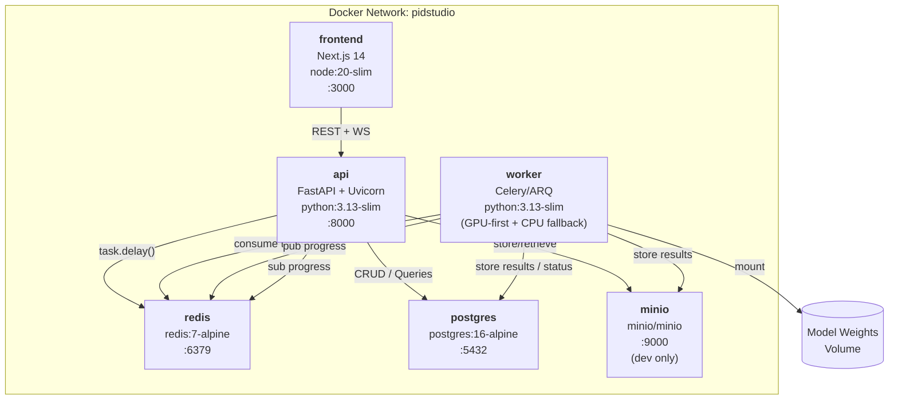
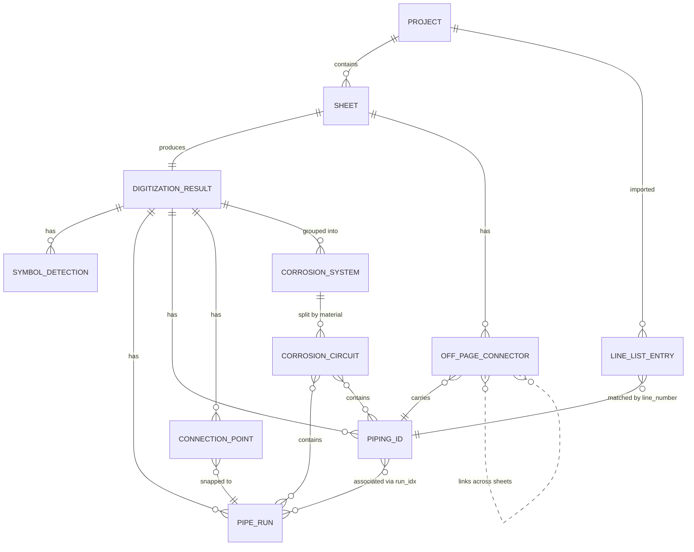
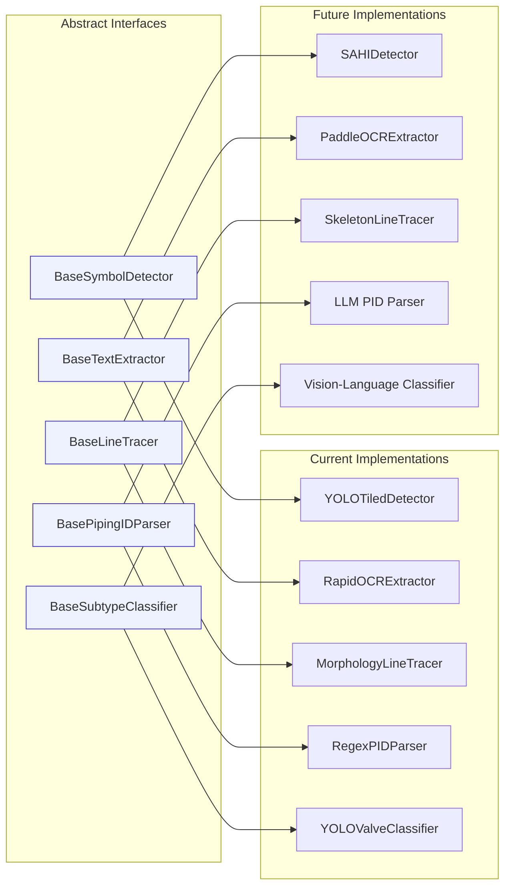
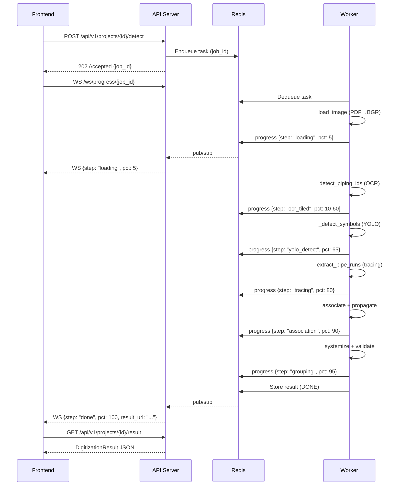
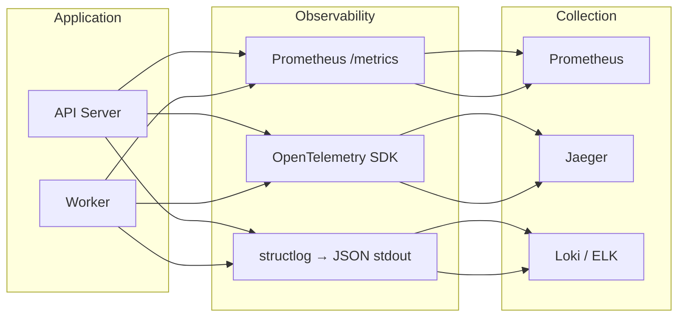

# P&ID Studio Web Platform — System Architecture

> Reference Architecture Document for the Re-Engineered P&ID Digitization & Corrosion Marking System

> **Current path (September 2026):** The sheet workspace uses HITL Fast Trace (`lines_only`) as its primary and default trace action. Vector PDFs bypass OCR/YOLO and full-size raster loading; raster inputs fall back to the raster tracer. OCR/YOLO run later through the explicit Sync with AI / Auto-Fill action after at least one run is marked. The old full-trace UI choice is removed; the legacy full-detection API mode remains for compatibility.

> **PDF tier routing:** `A1` and `A2` are heuristic vector-geometry labels, not paper sizes or quality grades. `tier_of` labels a page `raster` below 50 PyMuPDF drawing paths. At or above 50 paths, it labels the page `A1` when at least 50 paths contain a straight-line item, otherwise `A2`. Both vector tiers use the same vector extraction, and an empty result falls back to raster tracing. This is a routing heuristic; its threshold has not been benchmarked as a PDF quality score, and mixed scan-plus-vector pages can be classified as vector.

> **Opt-in marking:** Upload queues `lines_only` tracing in the background. Newly traced runs are stored with `marked: false`; the canvas keeps them hit-testable but transparent, shows a dashed gray hover hint, and persists the first click through `PATCH /result` as blue `#2563EB`. A double-click opens the run inspector; a single click on a marked run only selects it. Marked strokes stay fully opaque and use a thicker visible line. There is no `/trace-click` route; Magic Wand acts on the already traced geometry.

> **Line styling and symbol gaps:** The first pointer-down immediately previews the default `#2563EB` stroke while persistence runs. The inspector supports solid and dashed runs through the ordinary result JSON and exports. Vector Fast Trace preserves gradual open PDF curves as ordered polylines and leaves gaps at compact V/bowtie valves and qualifying transverse bars. Raster skeleton Fast Trace uses Hough geometry to mask compact V/bowtie and transverse-bar symbols, plus distance-transform width changes for compact inline bodies; it does not load YOLO. Supplied valve/instrument detections still mask their boxes. Physical gaps remain open for HITL correction. Skeleton graph nodes retain 8-neighbor T/crossover pairing; ordinary branches and crossings are not stopped by graph degree alone.

> **Manual corrosion groups and AI synchronization:** System and circuit groups created by the engineer are stored in `result_json.manual_groups`; their run membership, color, and kind are persisted alongside the line geometry. The **Corrosion Groups** section is explicitly rendered directly in the right sidebar inspector across sheet views, featuring a visible **Add New Group** button. Selecting a group enters **Active Group (Color Brush Mode)**: clicking any line in the canvas instantly marks it (`marked: true`), changes its color to the active group, assigns it without opening popovers, and updates backend persistence. AI enrichment reads the saved result, detects page-wide OCR text and symbols, but associates OCR names only with `marked: true` runs. Unmarked geometry and its existing piping IDs remain unchanged. The canvas can hide/show unmarked detected lines without changing their stored data. Automatic AI systemization suggestions are not applied by this sync action.

> **Group colors and stamps:** New manual groups take the first unused color from the canvas quick-color palette, with additional distinct hues when that palette is exhausted. The engineer can still change a group's color; assigned runs are updated with it. Groups with marked runs render a draggable name stamp in the SVG overlay. Its initial coordinates default to the midpoint of its longest member run. Pointer gestures on the stamp temporarily suspend OpenSeadragon mouse navigation (`applyMouseNav(viewer, false)`), allowing smooth drag-and-drop repositioning anywhere on the canvas without panning the underlying CAD image. Its `stampPosition` is saved on the group in source drawing pixel coordinates and persisted through whole-result `PATCH /result`. PDF export draws a bordered text box at that saved position in the group color. Groups from older results without a saved position retain the legacy longest-run stamp placement. The default PDF legend remains disabled.

> **For future contributors and agents:** Read [`AGENTS.md`](../AGENTS.md) for the current product constraints and verification checklist before changing this pipeline. Treat diagrams below as architecture context; the active sheet page, detection service, and orchestrator are the source of truth for runtime behavior.

---

## 1. Architecture Philosophy

### Design Principles

| Principle | Application |
|---|---|
| **Loose Coupling** | Every CV component (detector, OCR, tracer) behind an abstract interface (`Protocol`); swappable without touching consumers |
| **High Cohesion** | Each module owns exactly one domain concern (detection, tracing, systemization, export) |
| **Adapter Pattern** | Infrastructure (storage, PDF rendering, task queue) abstracted behind ports; adapters are interchangeable |
| **Deterministic Domain Layer** | All engineering logic (API RP 970, propagation, validation) is rule-based and auditable — **zero ML in reasoning layer** |
| **Idempotent Processing** | Re-running detection on the same input produces identical output; manual corrections are preserved across re-runs |

---

## 2. High-Level Architecture

```
┌──────────────────────────────────────────────────────────────────────┐
│                         PRESENTATION LAYER                          │
│                                                                      │
│  ┌────────────────────────────────────────────────────────────────┐  │
│  │                     Next.js / React SPA                        │  │
│  │                                                                │  │
│  │  ┌─────────────┐  ┌──────────────┐  ┌──────────────────────┐  │  │
│  │  │ OpenSeadragon│  │ SVG Overlay  │  │ Zustand State Store  │  │  │
│  │  │ Deep-Zoom    │  │ (bbox/poly)  │  │ (undo, result, ui)  │  │  │
│  │  │ Tile Viewer  │  │              │  │                      │  │  │
│  │  └─────────────┘  └──────────────┘  └──────────────────────┘  │  │
│  │                                                                │  │
│  │  ┌──────────────┐  ┌──────────────┐  ┌──────────────────────┐ │  │
│  │  │ Project List │  │ Detection    │  │ System / Circuit     │ │  │
│  │  │ Page         │  │ Result View  │  │ Marking View         │ │  │
│  │  └──────────────┘  └──────────────┘  └──────────────────────┘ │  │
│  └────────────────────────────────────────────────────────────────┘  │
│         │ REST API + WebSocket                                       │
└─────────┼────────────────────────────────────────────────────────────┘
          │
┌─────────▼────────────────────────────────────────────────────────────┐
│                         APPLICATION LAYER                            │
│                                                                      │
│  ┌────────────────────────────────────────────────────────────────┐  │
│  │                     FastAPI Backend                             │  │
│  │                                                                │  │
│  │  ┌──────────┐  ┌──────────┐  ┌──────────┐  ┌──────────────┐  │  │
│  │  │ Project  │  │ Detection│  │ Grouping │  │ Export        │  │  │
│  │  │ Router   │  │ Router   │  │ Router   │  │ Router        │  │  │
│  │  └──────────┘  └──────────┘  └──────────┘  └──────────────┘  │  │
│  │                                                                │  │
│  │  ┌──────────────────────────────────────────────────────────┐  │  │
│  │  │ Service Layer                                            │  │  │
│  │  │ ProjectService | DetectionService | GroupingService |     │  │  │
│  │  │ ExportService | TileService | ValidationService          │  │  │
│  │  └──────────────────────────────────────────────────────────┘  │  │
│  └────────────────────────────────────────────────────────────────┘  │
│         │ Task Queue (Celery/ARQ)                                    │
└─────────┼────────────────────────────────────────────────────────────┘
          │
┌─────────▼────────────────────────────────────────────────────────────┐
│                         DOMAIN LAYER (pidcorr)                       │
│                                                                      │
│  ┌────────────────────────────────────────────────────────────────┐  │
│  │                  Perception Interfaces                         │  │
│  │  BaseSymbolDetector | BaseTextExtractor | BaseLineTracer |     │  │
│  │  BasePipingIDParser | BaseSubtypeClassifier                    │  │
│  └────────────────────────────────────────────────────────────────┘  │
│  ┌────────────────────────────────────────────────────────────────┐  │
│  │                  Concrete Implementations                      │  │
│  │  YOLOTiledDetector | SAHIDetector | RapidOCRExtractor |        │  │
│  │  PaddleOCRExtractor | MorphologyTracer | SkeletonTracer |      │  │
│  │  RegexParser | ValveClassifier | ISAParser                     │  │
│  └────────────────────────────────────────────────────────────────┘  │
│  ┌────────────────────────────────────────────────────────────────┐  │
│  │                  Engineering Logic (Deterministic)              │  │
│  │  pipeline.py | propagate.py | systemize.py | connpoint.py |    │  │
│  │  validate.py | review.py | asset_register.py | export.py      │  │
│  └────────────────────────────────────────────────────────────────┘  │
└──────────────────────────────────────────────────────────────────────┘
          │
┌─────────▼────────────────────────────────────────────────────────────┐
│                       INFRASTRUCTURE LAYER                           │
│                                                                      │
│  ┌──────────┐  ┌──────────┐  ┌──────────┐  ┌──────────────────┐    │
│  │ Redis    │  │ Object   │  │ PDF      │  │ Result Store     │    │
│  │ (Broker  │  │ Store    │  │ Renderer │  │ (JSON / JSONB)   │    │
│  │  +Cache) │  │ (S3/     │  │ (pypdf   │  │                  │    │
│  │          │  │  MinIO)  │  │  ium2)   │  │                  │    │
│  └──────────┘  └──────────┘  └──────────┘  └──────────────────┘    │
└──────────────────────────────────────────────────────────────────────┘
```

---

## 3. Container Architecture



---

## 4. Domain Model



---

## 5. Component Interface Map (Adapter Pattern)



---

## 6. Processing Pipeline (Async Worker)



---

## 7. Frontend Architecture

```
src/
├── app/                          # Next.js App Router
│   ├── layout.tsx                # Root layout
│   ├── page.tsx                  # Project list (home)
│   ├── project/[id]/
│   │   ├── page.tsx              # Main workspace
│   │   ├── digitize/page.tsx     # Digitization view
│   │   ├── system/page.tsx       # Corrosion System view
│   │   └── circuit/page.tsx      # Corrosion Circuit view
│   └── api/                      # Next.js API routes (proxy)
├── components/
│   ├── canvas/
│   │   ├── DeepZoomViewer.tsx    # OpenSeadragon wrapper
│   │   ├── OverlayLayer.tsx      # SVG overlay for bboxes/polylines
│   │   ├── BboxEditor.tsx        # Drag-to-edit bounding box
│   │   ├── PolylineRenderer.tsx  # Colored pipe run rendering
│   │   └── RubberBand.tsx        # Draw-to-select / add symbol
│   ├── panels/
│   │   ├── PipingIDTable.tsx     # Filterable piping ID table
│   │   ├── SymbolTable.tsx       # Symbol list by category
│   │   ├── SystemLegend.tsx      # Corrosion system legend
│   │   ├── CircuitTree.tsx       # Hierarchical circuit tree
│   │   ├── ReviewPanel.tsx       # Anomaly review list
│   │   └── ValidationReport.tsx  # Score + checks display
│   ├── dialogs/
│   │   ├── ExportDialog.tsx      # Format selection + download
│   │   ├── TeachParsingDialog.tsx# Schema-by-example
│   │   └── LineListImport.tsx    # Excel/CSV upload
│   └── ui/                       # Shared UI primitives
├── hooks/
│   ├── useDetection.ts           # Detection trigger + WS progress
│   ├── useResult.ts              # React Query for result CRUD
│   ├── useCanvas.ts              # Zoom/pan state, coordinate mapping
│   ├── useUndo.ts                # Zustand undo/redo middleware
│   └── useExport.ts              # Export API calls
├── store/
│   ├── projectStore.ts           # Zustand: active project
│   ├── resultStore.ts            # Zustand: detection result + edits
│   └── uiStore.ts                # Zustand: view mode, selection, tool
├── lib/
│   ├── api.ts                    # API client (fetch wrapper)
│   ├── ws.ts                     # WebSocket client
│   └── colorUtils.ts             # Fluid color palette (matching backend)
└── types/
    ├── result.ts                 # TypeScript types matching Pydantic schemas
    ├── system.ts                 # Corrosion system/circuit types
    └── api.ts                    # API request/response types
```

---

## 8. Backend Module Structure

```
backend/
├── app/
│   ├── main.py                   # FastAPI app factory, lifespan, middleware
│   ├── config.py                 # Settings (Pydantic BaseSettings)
│   ├── routers/
│   │   ├── projects.py           # /api/v1/projects CRUD
│   │   ├── detection.py          # /api/v1/projects/{id}/detect
│   │   ├── results.py            # /api/v1/projects/{id}/result GET/PATCH
│   │   ├── grouping.py           # /api/v1/projects/{id}/systemize
│   │   ├── validation.py         # /api/v1/projects/{id}/validate
│   │   ├── export.py             # /api/v1/projects/{id}/export
│   │   ├── tiles.py              # /api/v1/projects/{id}/tiles/{z}/{x}/{y}
│   │   └── ws.py                 # /ws/progress/{job_id}
│   ├── services/
│   │   ├── project_service.py    # File management, metadata
│   │   ├── detection_service.py  # Orchestrate pipeline via task queue
│   │   ├── grouping_service.py   # Systemize/circuitize wrapper
│   │   ├── export_service.py     # Generate deliverables
│   │   ├── tile_service.py       # DZI pyramid generation
│   │   └── validation_service.py # Run validators
│   ├── schemas/                  # Pydantic v2 data models
│   │   ├── symbol.py
│   │   ├── piping.py
│   │   ├── run.py
│   │   ├── result.py
│   │   ├── system.py
│   │   ├── project.py
│   │   ├── job.py
│   │   └── validation.py
│   └── adapters/
│       ├── storage.py            # ObjectStore protocol + impls
│       ├── pdf_renderer.py       # PDFRenderer protocol + pypdfium2
│       └── result_store.py       # ResultStore protocol + impls
├── worker/
│   ├── celery_app.py             # Celery configuration
│   ├── tasks/
│   │   ├── detect_task.py        # run_pipeline wrapper
│   │   └── export_task.py        # Long-running export generation
│   └── progress.py               # Redis pub/sub progress reporter
├── pidcorr/                      # Core library (extracted, no GUI deps)
│   ├── interfaces/
│   │   ├── perception.py         # BaseSymbolDetector, BaseTextExtractor, etc.
│   │   └── infrastructure.py     # PDFRenderer, ObjectStore protocols
│   ├── implementations/
│   │   ├── yolo_detector.py      # Current YOLOTiledDetector
│   │   ├── rapidocr_extractor.py # Current RapidOCR wrapper
│   │   ├── morphology_tracer.py  # Current line tracing
│   │   └── regex_parser.py       # Current piping ID parser
│   ├── pipeline.py               # Orchestrator (accepts injected components)
│   ├── propagate.py              # Label propagation (unchanged)
│   ├── systemize.py              # API RP 970 logic (unchanged)
│   ├── connpoint.py              # Connection point detection (unchanged)
│   ├── validate.py               # Validation engine (unchanged)
│   ├── review.py                 # Anomaly detection (unchanged)
│   ├── asset_register.py         # Asset register builder (unchanged)
│   └── export.py                 # PDF/Excel/Word export (unchanged)
├── tests/
│   ├── unit/
│   ├── integration/
│   └── snapshots/                # Expected outputs for regression testing
├── Dockerfile
├── Dockerfile.worker
└── docker-compose.yml
```

---

## 9. Technology Matrix

| Layer | Technology | Version | License | Purpose |
|---|---|---|---|---|
| **Frontend** | Next.js | 14+ | MIT | React SSR/SSG framework |
| | TypeScript | 5.x | Apache-2.0 | Type safety |
| | Tailwind CSS | 3.x | MIT | Utility-first styling |
| | OpenSeadragon | 4.x | New BSD | Deep-zoom tile viewer |
| | Zustand | 4.x | MIT | State management |
| | React Query | 5.x | MIT | Server state caching |
| **Backend** | FastAPI | 0.110+ | MIT | Async REST framework |
| | Uvicorn | 0.30+ | BSD | ASGI server |
| | Pydantic | 2.x | MIT | Schema validation |
| | Celery | 5.4+ | BSD | Distributed task queue |
| | Redis | 7.x | BSD | Broker + pub/sub + cache |
| **CV/ML** | ultralytics | 8.4.70 | AGPL-3.0 | YOLO object detection |
| | RapidOCR | 1.2.3 | Apache-2.0 | OCR engine (current) |
| | PaddleOCR | 2.8+ | Apache-2.0 | OCR engine (Phase B) |
| | SAHI | 0.11+ | MIT | Sliced inference |
| | OpenCV | 4.9+ | Apache-2.0 | Image processing |
| **PDF** | pypdfium2 | 4.x | Apache-2.0/BSD | PDF rendering (replaces PyMuPDF) |
| | PyMuPDF | 1.24+ | AGPL-3.0 | PDF annotation export (kept for export only) |
| **Export** | openpyxl | 3.1+ | MIT | Excel generation |
| | python-docx | 1.x | MIT | Word generation |
| **Infra** | Docker | 24+ | Apache-2.0 | Containerization |
| | MinIO | latest | AGPL-3.0 | Object storage (dev) |

---

## 10. Security Architecture

```
┌──────────────────────────────────────────────┐
│                  Reverse Proxy                │
│              (nginx / Traefik)                │
│          TLS termination, rate limit          │
├──────────────────────────────────────────────┤
│        ┌──────────────────────────┐          │
│        │  JWT Auth Middleware     │          │
│        │  (Phase C: multi-user)  │          │
│        └──────────────────────────┘          │
│                     │                        │
│  ┌──────────────────▼──────────────────┐     │
│  │  CORS: frontend origin only        │     │
│  │  File upload: ext whitelist + size  │     │
│  │  Container: non-root, ro filesystem │     │
│  │  Redis: password auth, no public    │     │
│  │  MinIO: access key + secret key     │     │
│  └─────────────────────────────────────┘     │
└──────────────────────────────────────────────┘
```

---

## 11. Observability Stack



Key metrics to monitor:
- `pidstudio_detection_duration_seconds` (histogram, per stage)
- `pidstudio_active_jobs` (gauge)
- `pidstudio_symbols_detected_total` (counter, per coarse class)
- `pidstudio_ocr_piping_ids_total` (counter)
- `pidstudio_export_requests_total` (counter, per format)

---

*This document should be read alongside [IMPLEMENTATION_PLAN.md](file:///c:/Werk/pidccs/docs/IMPLEMENTATION_PLAN.md) for the phased task breakdown and verification criteria.*
